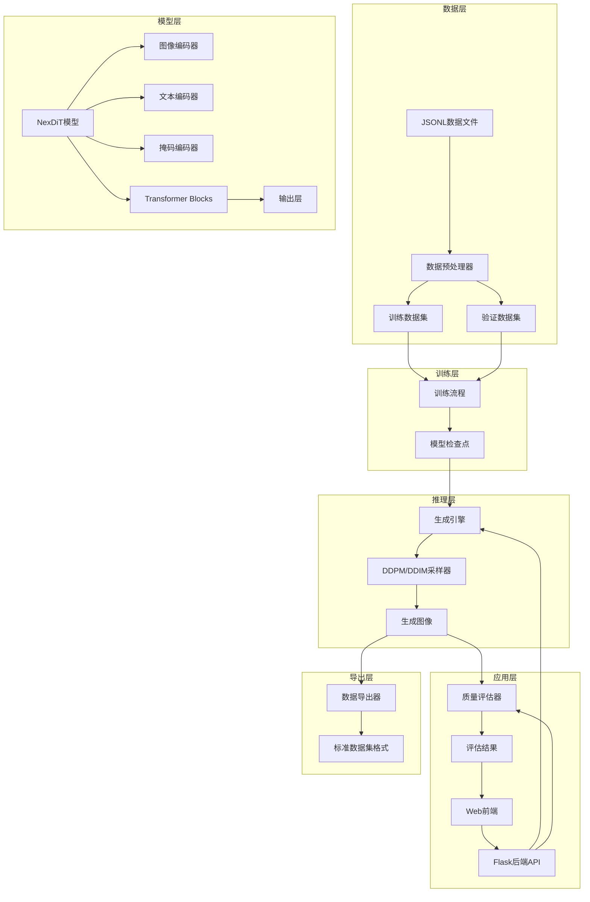

# Design Document: Medical Image Augmentation System

## Overview

本系统基于现有的RetinaLogos项目（视网膜图像文本生成模型）进行扩展，构建一个支持多模态输入的医学影像生成与增广平台。系统的核心是将分割掩码作为结构条件融入Diffusion Transformer模型，使生成的医学影像在保持高质量的同时符合解剖结构约束。

### 核心设计理念

1. **简单优先**: 采用最直接的技术方案，避免过度设计
2. **渐进式扩展**: 在现有RetinaLogos代码基础上最小化修改
3. **模块化架构**: 数据处理、模型训练、推理生成和Web界面相互独立
4. **实用导向**: 优先实现核心功能，复杂评估指标通过离线脚本完成

### 系统架构概览

系统由四个主要模块组成：

1. **数据处理模块**: 处理JSONL格式的多模态数据（图像+文本+掩码）
2. **模型训练模块**: 扩展NexDiT模型支持掩码条件输入
3. **推理生成模块**: 使用训练好的模型生成增广图像
4. **Web界面模块**: 提供用户友好的交互界面

## Architecture

### 系统架构图



### 技术栈选择

**后端**:
- Python 3.10+
- PyTorch 2.0+ (深度学习框架)
- Gradio 4.0+ (演示界面框架)
- Pillow (图像处理)
- NumPy (数值计算)

**前端**:
- Gradio 4.0+ (快速构建演示界面，无需编写HTML/CSS/JS)

**模型架构**:
- NexDiT (Diffusion Transformer)
- Gemma-2B (文本编码器，继承自RetinaLogos)
- VAE (图像编解码器，继承自RetinaLogos)

### 模块间交互流程

**训练流程**:
```
JSONL数据 → 数据预处理 → 批次加载 → 模型前向传播 → 损失计算 → 反向传播 → 参数更新 → 保存检查点
```

**推理流程**:
```
用户输入(文本+掩码) → 文本编码 → 掩码处理 → 噪声初始化 → 迭代去噪 → VAE解码 → 生成图像
```

**Gradio界面交互流程**:
```
用户上传文件 → Gradio组件验证 → 调用生成函数 → 返回结果 → Gradio自动展示 → 用户下载
```

## Components and Interfaces

### 1. 数据预处理器 (Data Preprocessor)

**职责**: 加载和预处理多模态训练数据

**核心类**: `MultimodalDataProcessor`

**接口**:
```python
class MultimodalDataProcessor:
    def __init__(self, config: dict):
        """
        初始化数据处理器
        Args:
            config: 包含图像分辨率、归一化参数等配置
        """
        pass
    
    def load_jsonl(self, file_path: str) -> List[dict]:
        """
        加载JSONL格式数据文件
        Args:
            file_path: JSONL文件路径
        Returns:
            数据项列表，每项包含image_path, caption, mask_path
        """
        pass
    
    def preprocess_image(self, image_path: str) -> torch.Tensor:
        """
        预处理图像：调整大小、归一化
        Args:
            image_path: 图像文件路径
        Returns:
            预处理后的图像张量 [C, H, W]
        """
        pass
    
    def preprocess_mask(self, mask_path: str, target_size: tuple) -> torch.Tensor:
        """
        预处理分割掩码：调整大小、转换为整数标签
        Args:
            mask_path: 掩码文件路径
            target_size: 目标尺寸 (H, W)
        Returns:
            预处理后的掩码张量 [H, W]
        """
        pass
    
    def create_dataset(self, data_list: List[dict]) -> torch.utils.data.Dataset:
        """
        创建PyTorch数据集对象
        Args:
            data_list: 数据项列表
        Returns:
            Dataset对象
        """
        pass
```

**实现要点**:
- 继承RetinaLogos的`ItemProcessor`类，扩展支持掩码处理
- 使用torchvision.transforms进行图像变换
- 掩码缺失时返回零张量
- 自动处理尺寸不匹配问题

### 2. 掩码编码器 (Mask Encoder)

**职责**: 将分割掩码转换为模型输入格式

**核心函数**: `prepare_mask` (工具函数，不需要独立类)

**接口**:
```python
def prepare_mask(
    mask: torch.Tensor,
    target_size: tuple
) -> torch.Tensor:
    """
    准备掩码为模型输入（仅进行分辨率调整，不包含可学习参数）
    Args:
        mask: 掩码张量 [B, H, W]，值为类别标签（0, 1, 2, ...）或已归一化的浮点值
        target_size: 目标尺寸 (H, W)
    Returns:
        调整后的掩码张量 [B, 1, H, W]
    """
    pass
```

**实现要点**:
- 使用F.interpolate调整掩码到目标分辨率
- 保持掩码的原始通道数（通常为1或3）
- 支持零张量输入（无掩码情况）
- 这是一个纯数据转换函数，集成到数据预处理或模型输入处理中
- 不需要One-Hot编码，直接通道拼接即可

### 3. 扩展的NexDiT模型 (Extended NexDiT)

**职责**: 在原始NexDiT基础上支持掩码条件输入

**核心类**: `NextDiTWithMask`

**接口**:
```python
class NextDiTWithMask(nn.Module):
    def __init__(
        self,
        patch_size: int = 2,
        in_channels: int = 4,  # VAE潜在空间通道数
        mask_channels: int = 1,  # 掩码通道数（简化为1）
        dim: int = 4096,
        n_layers: int = 32,
        n_heads: int = 32,
        **kwargs
    ):
        """
        初始化扩展的NexDiT模型
        Args:
            in_channels: 输入图像通道数（VAE编码后）
            mask_channels: 掩码通道数（默认1）
            其他参数继承自原始NexDiT
        """
        super().__init__()
        pass
    
    def forward(
        self,
        x: torch.Tensor,
        t: torch.Tensor,
        cap_feats: torch.Tensor,
        cap_mask: torch.Tensor,
        condition_mask: torch.Tensor = None
    ) -> torch.Tensor:
        """
        前向传播
        Args:
            x: 噪声图像 [B, C, H, W]
            t: 时间步 [B]
            cap_feats: 文本特征 [B, L, D]
            cap_mask: 文本掩码 [B, L]
            condition_mask: 条件掩码 [B, 1, H, W]
        Returns:
            预测的噪声 [B, C, H, W]
        """
        pass
```

**实现要点**:
- 修改输入层通道数：`in_channels + mask_channels`
- 在patchify之前进行通道拼接：`torch.cat([x, condition_mask], dim=1)`
- 其余架构保持不变，复用原始NexDiT的所有组件
- 向后兼容：condition_mask为None时使用零张量替代

### 4. 训练流程管理器 (Training Pipeline)

**职责**: 管理模型训练过程

**核心类**: `TrainingPipeline`

**接口**:
```python
class TrainingPipeline:
    def __init__(self, config_path: str):
        """
        初始化训练流程
        Args:
            config_path: YAML配置文件路径
        """
        pass
    
    def setup_model(self) -> nn.Module:
        """
        初始化模型、优化器、学习率调度器
        Returns:
            模型实例
        """
        pass
    
    def train_epoch(self, dataloader: DataLoader, epoch: int):
        """
        训练一个epoch
        Args:
            dataloader: 训练数据加载器
            epoch: 当前epoch编号
        """
        pass
    
    def save_checkpoint(self, epoch: int, save_path: str):
        """
        保存模型检查点
        Args:
            epoch: 当前epoch
            save_path: 保存路径
        """
        pass
    
    def load_checkpoint(self, checkpoint_path: str):
        """
        加载模型检查点
        Args:
            checkpoint_path: 检查点文件路径
        """
        pass
```

**实现要点**:
- 使用YAML配置文件管理所有超参数
- 支持FSDP（Fully Sharded Data Parallel）分布式训练
- 每N步保存检查点
- 记录训练损失到日志文件
- 支持从检查点恢复训练

### 5. 生成引擎 (Generation Engine)

**职责**: 使用训练好的模型生成图像

**核心类**: `ImageGenerator`

**接口**:
```python
class ImageGenerator:
    def __init__(self, model_path: str, device: str = "cuda"):
        """
        初始化生成引擎
        Args:
            model_path: 模型检查点路径
            device: 计算设备
        """
        pass
    
    def generate(
        self,
        caption: str,
        mask: torch.Tensor = None,
        num_inference_steps: int = 50,
        guidance_scale: float = 7.5,
        seed: int = None
    ) -> torch.Tensor:
        """
        生成图像
        Args:
            caption: 文本描述
            mask: 可选的分割掩码
            num_inference_steps: 采样步数
            guidance_scale: CFG引导强度
            seed: 随机种子
        Returns:
            生成的图像张量 [C, H, W]
        """
        pass
    
    def batch_generate(
        self,
        captions: List[str],
        masks: List[torch.Tensor] = None,
        **kwargs
    ) -> List[torch.Tensor]:
        """
        批量生成图像
        Args:
            captions: 文本描述列表
            masks: 掩码列表
        Returns:
            生成的图像列表
        """
        pass
```

**实现要点**:
- 使用DDPM或DDIM采样算法
- 支持Classifier-Free Guidance (CFG)
- 使用VAE解码器将潜在表示转换为图像
- 支持设置随机种子以确保可重现性

### 6. 质量评估器 (Quality Evaluator)

**职责**: 计算生成图像的质量指标（离线脚本）

**核心脚本**: `evaluate.py`

**接口**:
```python
class QualityEvaluator:
    def __init__(self):
        """初始化评估器"""
        pass
    
    def calculate_psnr(
        self,
        generated: torch.Tensor,
        reference: torch.Tensor
    ) -> float:
        """
        计算PSNR
        Args:
            generated: 生成图像
            reference: 参考图像
        Returns:
            PSNR值
        """
        pass
    
    def calculate_ssim(
        self,
        generated: torch.Tensor,
        reference: torch.Tensor
    ) -> float:
        """
        计算SSIM
        Args:
            generated: 生成图像
            reference: 参考图像
        Returns:
            SSIM值
        """
        pass
    
    def evaluate_batch(
        self,
        generated_dir: str,
        reference_dir: str
    ) -> dict:
        """
        批量评估整个目录
        Args:
            generated_dir: 生成图像目录
            reference_dir: 参考图像目录
        Returns:
            包含所有指标的字典
        """
        pass
    
    def save_results(self, results: dict, output_path: str):
        """
        保存评估结果到JSON文件
        Args:
            results: 评估结果字典
            output_path: 输出文件路径
        """
        pass
```

**实现要点**:
- 使用skimage或torchmetrics库计算指标
- PSNR和SSIM是快速计算的基本指标
- 不集成到Gradio实时计算中，避免演示卡顿
- 作为独立的离线分析工具使用

### 7. Gradio演示界面 (Gradio Demo)

**职责**: 提供用户友好的演示界面

**核心模块**: `demo.py`

**接口**:
```python
def generate_image(
    input_image: np.ndarray,
    mask_image: np.ndarray,
    caption: str,
    num_steps: int,
    guidance_scale: float,
    seed: int
) -> Tuple[np.ndarray, str]:
    """
    Gradio生成函数
    Args:
        input_image: 输入参考图像（可选）
        mask_image: 输入掩码图像
        caption: 文本描述
        num_steps: 采样步数
        guidance_scale: CFG引导强度
        seed: 随机种子
    Returns:
        (生成的图像, 状态信息文本)
    """
    pass

def create_demo() -> gr.Blocks:
    """
    创建Gradio界面
    Returns:
        Gradio Blocks对象
    """
    with gr.Blocks(title="医学影像增广系统") as demo:
        gr.Markdown("# 医学影像增广系统演示")
        
        with gr.Row():
            with gr.Column():
                input_image = gr.Image(label="参考图像（可选）", type="numpy")
                mask_image = gr.Image(label="分割掩码", type="numpy")
                caption = gr.Textbox(label="文本描述", lines=3)
                
                with gr.Row():
                    num_steps = gr.Slider(10, 100, value=50, label="采样步数")
                    guidance_scale = gr.Slider(1.0, 20.0, value=7.5, label="引导强度")
                    seed = gr.Number(value=42, label="随机种子")
                
                generate_btn = gr.Button("生成图像", variant="primary")
            
            with gr.Column():
                output_image = gr.Image(label="生成结果")
                status_text = gr.Textbox(label="状态信息", lines=3)
        
        # 示例输入
        gr.Examples(
            examples=[
                ["examples/image1.jpg", "examples/mask1.png", "Fundus photograph showing...", 50, 7.5, 42],
            ],
            inputs=[input_image, mask_image, caption, num_steps, guidance_scale, seed]
        )
        
        generate_btn.click(
            fn=generate_image,
            inputs=[input_image, mask_image, caption, num_steps, guidance_scale, seed],
            outputs=[output_image, status_text]
        )
    
    return demo
```

**实现要点**:
- 使用Gradio 4.0+的Blocks API构建界面
- 所有组件都是Gradio内置的，无需编写HTML/CSS/JS
- 文件上传、参数设置、结果展示全部通过Gradio组件实现
- 自动提供下载功能（Gradio内置）
- 支持示例输入快速演示
- 总代码量约30-50行Python代码

### 8. 数据导出器 (Data Exporter)

**职责**: 保存生成结果和元数据

**核心函数**: `save_generation_result`

**接口**:
```python
def save_generation_result(
    image: torch.Tensor,
    caption: str,
    mask: torch.Tensor = None,
    output_dir: str = "./results",
    metadata: dict = None
) -> str:
    """
    保存生成结果
    Args:
        image: 生成的图像
        caption: 文本描述
        mask: 输入掩码（可选）
        output_dir: 输出目录
        metadata: 额外的元数据（如生成参数）
    Returns:
        保存的文件路径
    """
    pass

def create_dataset_manifest(
    results_dir: str,
    output_path: str
) -> str:
    """
    创建数据集清单文件
    Args:
        results_dir: 结果目录
        output_path: 清单文件输出路径
    Returns:
        清单文件路径
    """
    pass
```

**实现要点**:
- 简单的文件保存功能，保存为PNG格式
- 生成metadata.json记录生成参数
- 创建JSONL格式的清单文件
- 不需要复杂的数据集格式转换（ImageFolder、COCO等）

## Data Models

### 1. 数据文件格式

**JSONL训练数据格式**:
```json
{"image_path": "data/images/001.jpg", "caption": "Fundus photograph showing...", "mask_path": "data/masks/001.png"}
{"image_path": "data/images/002.jpg", "caption": "Retinal image with...", "mask_path": null}
```

**字段说明**:
- `image_path`: 图像文件相对路径或绝对路径
- `caption`: 文本描述（医学报告或病理描述）
- `mask_path`: 分割掩码路径，可为null（表示无掩码）

### 2. 配置文件格式

**训练配置 (train_config.yaml)**:
```yaml
# 模型配置
model:
  name: "NextDiTWithMask"
  patch_size: 2
  in_channels: 4
  mask_channels: 4
  dim: 4096
  n_layers: 32
  n_heads: 32

# 训练配置
training:
  batch_size: 8
  learning_rate: 1.0e-6
  max_steps: 400000
  gradient_accumulation_steps: 1
  mixed_precision: "bf16"
  checkpoint_interval: 5000
  log_interval: 100

# 数据配置
data:
  train_data: "data/train.jsonl"
  val_data: "data/val.jsonl"
  image_size: 512
  num_workers: 4

# 输出配置
output:
  checkpoint_dir: "./checkpoints"
  log_dir: "./logs"
```

**推理配置 (inference_config.yaml)**:
```yaml
# 模型配置
model:
  checkpoint_path: "./checkpoints/model_final.pt"
  device: "cuda"

# 采样配置
sampling:
  num_inference_steps: 50
  guidance_scale: 7.5
  sampler: "ddim"  # 或 "ddpm"

# 输出配置
output:
  output_dir: "./results"
  save_format: "png"
```

### 3. 内部数据结构

**数据批次结构**:
```python
@dataclass
class DataBatch:
    images: torch.Tensor  # [B, C, H, W]
    captions: List[str]   # [B]
    masks: torch.Tensor   # [B, 1, H, W] 或 None
    image_paths: List[str]  # [B]
```

**生成结果结构**:
```python
@dataclass
class GenerationResult:
    image: torch.Tensor  # [C, H, W]
    caption: str
    mask: torch.Tensor  # [1, H, W] 或 None
    metrics: dict  # {"psnr": float, "ssim": float}
    timestamp: datetime
    seed: int
```

**评估结果结构**:
```python
@dataclass
class EvaluationResult:
    psnr: float
    ssim: float
    generation_time: float
    model_config: dict
    timestamp: datetime
```

### 4. 数据持久化

**文件系统组织**:

系统使用文件系统作为数据存储，不使用数据库。所有生成结果和元数据通过文件管理。

**生成结果存储**:
```
results/
├── {timestamp}_{uuid}/
│   ├── generated.png
│   ├── input_mask.png (如果有)
│   └── metadata.json
```

**metadata.json格式**:
```json
{
    "id": "uuid",
    "caption": "text description",
    "mask_path": "input_mask.png",
    "image_path": "generated.png",
    "metrics": {
        "psnr": 28.5,
        "ssim": 0.85
    },
    "parameters": {
        "num_steps": 50,
        "guidance_scale": 7.5,
        "seed": 42
    },
    "timestamp": "2024-01-01T12:00:00"
}
```

**导出数据集清单**:
```
exports/
├── dataset_{timestamp}/
│   ├── images/
│   ├── masks/
│   └── manifest.jsonl
```

**manifest.jsonl格式**:
```jsonl
{"image_path": "images/001.png", "caption": "...", "mask_path": "masks/001.png", "source": "generated", "quality_score": 0.85}
{"image_path": "images/002.png", "caption": "...", "mask_path": "masks/002.png", "source": "original", "quality_score": null}
```

**优势**:
- 无需数据库连接和ORM
- 易于备份和迁移
- 直接可读的文件格式
- 适合毕设规模的数据量

### 5. 文件系统组织

**项目目录结构**:
```
medical-image-augmentation-system/
├── data/
│   ├── train.jsonl
│   ├── val.jsonl
│   ├── images/
│   └── masks/
├── configs/
│   ├── train_config.yaml
│   └── inference_config.yaml
├── src/
│   ├── data/
│   │   ├── preprocessor.py
│   │   └── dataset.py
│   ├── models/
│   │   └── nexdit_mask.py
│   ├── training/
│   │   └── pipeline.py
│   ├── inference/
│   │   └── generator.py
│   ├── evaluation/
│   │   └── evaluator.py
│   └── app/
│       └── demo.py
├── checkpoints/
├── results/
├── logs/
├── examples/
├── train.py
├── inference.py
├── evaluate.py
└── requirements.txt
```


## Correctness Properties

*属性（Property）是一个应该在系统所有有效执行中保持为真的特征或行为——本质上是关于系统应该做什么的形式化陈述。属性是人类可读规范和机器可验证正确性保证之间的桥梁。*

基于需求文档中的验收标准，我们定义以下可测试的正确性属性：

### Property 1: JSONL解析完整性

*For any* 有效的JSONL文件，解析后返回的数据项列表应该包含所有必需字段（image_path和caption），并且对于包含mask_path字段的数据项，该字段应该被正确提取。

**Validates: Requirements 1.1**

### Property 2: 缺失掩码处理

*For any* 数据项，如果mask_path字段缺失或为null，系统应该将该数据项标记为仅文本模式，并使用零张量作为掩码输入，而不是抛出错误。

**Validates: Requirements 1.2, 3.4**

### Property 3: 掩码尺寸自动调整

*For any* 图像和掩码对，如果掩码尺寸与图像不匹配，预处理后的掩码尺寸应该与图像尺寸相同。

**Validates: Requirements 1.3**


### Property 4: 批量数据加载

*For any* 包含多个JSONL文件的目录，批量加载功能应该加载所有文件中的数据项，总数据项数应该等于各文件数据项数之和。

**Validates: Requirements 1.4**

### Property 5: 数据统计日志

*For any* 数据加载操作，完成后日志文件应该包含数据统计信息（如总样本数、包含掩码的样本数）。

**Validates: Requirements 1.5**

### Property 6: 图像分辨率标准化

*For any* 输入图像和目标分辨率，预处理后的图像尺寸应该等于目标分辨率。

**Validates: Requirements 2.1**

### Property 7: 像素值归一化范围

*For any* 输入图像，归一化后的所有像素值应该在配置指定的范围内（[0, 1]或[-1, 1]）。

**Validates: Requirements 2.2**


### Property 8: 掩码格式转换

*For any* 输入掩码，转换后的掩码应该是整数类型（torch.int或torch.long），并且所有值应该是有效的类别标签。

**Validates: Requirements 2.3**

### Property 9: 预处理数据持久化

*For any* 预处理操作，完成后指定输出目录应该包含预处理后的数据文件。

**Validates: Requirements 2.4**

### Property 10: 掩码处理输出维度

*For any* 输入掩码和目标分辨率，掩码处理函数的输出张量应该具有与图像相同的空间维度（H, W）。

**Validates: Requirements 3.1**

### Property 11: 模型多模态输入接口

*For any* 文本embedding、掩码张量和噪声图像，模型应该能够接收这些输入并返回预测的噪声，不抛出维度不匹配错误。

**Validates: Requirements 3.2**


### Property 12: 通道拼接正确性

*For any* 噪声图像（C_img通道）和掩码（C_mask通道），通道拼接后的张量应该有C_img + C_mask个通道。

**Validates: Requirements 3.3**

### Property 13: 配置文件解析

*For any* 包含必需参数（学习率、批次大小、训练轮数、图像分辨率）的有效YAML文件，系统应该能够正确解析并返回这些参数值。

**Validates: Requirements 4.1**

### Property 14: 检查点保存周期性

*For any* 训练过程，每N个迭代后，指定目录应该包含新的检查点文件。

**Validates: Requirements 4.2**

### Property 15: 训练损失日志记录

*For any* 训练迭代，日志文件应该包含该迭代的损失值记录。

**Validates: Requirements 4.3**


### Property 16: 检查点恢复一致性（Round-trip）

*For any* 模型状态，保存为检查点后再加载，加载后的模型参数应该与保存前相同。

**Validates: Requirements 4.4**

### Property 17: 生成引擎输入灵活性

*For any* 文本描述，无论是否提供掩码，生成引擎都应该能够成功生成图像。

**Validates: Requirements 5.1**

### Property 18: 采样算法输出有效性

*For any* 有效输入（文本和可选掩码），使用DDPM或DDIM采样后，生成的图像应该具有正确的形状（C, H, W）和数据类型（float）。

**Validates: Requirements 5.2**

### Property 19: 图像文件保存

*For any* 生成的图像，保存操作完成后，指定输出目录应该包含对应的PNG文件。

**Validates: Requirements 5.3**


### Property 20: 批量生成数量一致性

*For any* N个输入（文本描述列表），批量生成应该返回N张图像。

**Validates: Requirements 5.4**

### Property 21: 质量指标计算与保存（离线）

*For any* 生成图像和参考图像对，质量评估脚本应该能够计算PSNR和SSIM指标，并将结果保存到JSON文件中。

**Validates: Requirements 9.2, 9.3**

### Property 22: Gradio文件格式验证

*For any* 上传的文件，如果格式不在支持列表中（PNG、JPEG），Gradio组件应该拒绝上传或系统应该返回错误信息。

**Validates: Requirements 7.2**

### Property 23: 生成结果保存

*For any* 生成的图像，保存操作完成后，指定输出目录应该包含对应的PNG文件和metadata.json文件。

**Validates: Requirements 7.5**


### Property 24: 数据集清单格式正确性

*For any* 生成结果集，创建清单文件后，应该包含所有样本的信息（图像路径、文本描述、元数据）。

**Validates: Requirements 9.1, 9.2**

### Property 26: 错误信息记录

*For any* 系统错误（如文件不存在、格式错误），错误信息应该被记录到日志文件，并且返回给用户的错误提示应该包含错误原因。

**Validates: Requirements 10.1, 10.3**

## Error Handling

### 错误分类

系统错误分为以下几类：

1. **输入验证错误**: 文件格式错误、路径不存在、数据格式不正确
2. **资源错误**: GPU内存不足、磁盘空间不足
3. **模型错误**: 模型加载失败、推理失败、维度不匹配
4. **配置错误**: 配置文件格式错误、参数值无效

### 错误处理策略

**输入验证错误**:
- 在数据加载阶段进行早期验证
- 返回明确的错误信息，指出具体的问题字段或文件
- 对于批量操作，记录失败项但继续处理其他项
- Gradio界面通过gr.Error()显示错误信息
- 示例：`"Error: mask file not found at path 'data/masks/001.png'"`

**资源错误**:
- 捕获CUDA out of memory异常
- 返回错误信息并建议解决方案（如减小批次大小）
- 自动清理GPU缓存后重试（可选）
- 示例：`"Error: GPU memory insufficient. Try reducing batch_size from 8 to 4."`

**模型错误**:
- 捕获模型加载和推理过程中的异常
- 记录详细的错误堆栈到日志文件
- 返回用户友好的错误信息
- 示例：`"Error: Model checkpoint corrupted. Please re-download the checkpoint file."`


**配置错误**:
- 在启动时验证配置文件
- 对于缺失的必需参数，使用默认值并发出警告
- 对于无效的参数值，返回错误并拒绝启动
- 示例：`"Error: Invalid learning_rate value '-0.001'. Must be positive."`

### 日志记录

**日志级别**:
- `DEBUG`: 详细的调试信息（如每个batch的处理细节）
- `INFO`: 一般信息（如训练开始、检查点保存）
- `WARNING`: 警告信息（如使用默认参数、数据项跳过）
- `ERROR`: 错误信息（如文件加载失败、模型推理失败）

**日志格式**:
```
[2024-01-01 12:00:00] [INFO] [DataPreprocessor] Loaded 1000 samples from train.jsonl
[2024-01-01 12:00:05] [WARNING] [DataPreprocessor] Skipped 5 samples due to missing image files
[2024-01-01 12:00:10] [ERROR] [ModelTrainer] CUDA out of memory. Batch size: 8
```

**日志文件管理**:
- 每次运行创建新的日志文件，命名格式：`{task}_{timestamp}.log`
- 日志文件保存在`logs/`目录
- 定期清理超过30天的旧日志文件

## Testing Strategy

### 测试方法概述

系统采用**双重测试策略**：单元测试和基于属性的测试（Property-Based Testing, PBT）相结合。

- **单元测试**: 验证特定示例、边缘情况和错误条件
- **属性测试**: 验证跨所有输入的通用属性
- 两者互补，共同确保全面覆盖


### 单元测试策略

**测试框架**: pytest

**测试组织**:
```
tests/
├── unit/
│   ├── test_data_preprocessor.py
│   ├── test_model.py
│   ├── test_generator.py
│   └── test_evaluator.py
├── integration/
│   └── test_training_pipeline.py
└── fixtures/
    ├── sample_images/
    ├── sample_masks/
    └── sample_configs/
```

**单元测试重点**:
- 特定示例：测试已知输入输出对
- 边缘情况：空文件、单像素图像、极大/极小值
- 错误条件：无效输入、缺失文件、格式错误
- 集成点：模块间接口、API端点

**示例单元测试**:
```python
def test_preprocess_image_resize():
    """测试图像调整到目标分辨率"""
    image = Image.new('RGB', (1024, 768))
    preprocessor = MultimodalDataProcessor({'image_size': 512})
    result = preprocessor.preprocess_image(image)
    assert result.shape == (3, 512, 512)

def test_mask_missing_handling():
    """测试缺失掩码的处理"""
    data_item = {"image_path": "img.jpg", "caption": "test"}
    processor = MultimodalDataProcessor({})
    image, caption, mask = processor.process_item(data_item)
    assert mask is not None  # 应该返回零张量
    assert torch.all(mask == 0)
```


### 基于属性的测试策略

**测试框架**: Hypothesis (Python的PBT库)

**配置要求**:
- 每个属性测试最少运行100次迭代
- 每个测试必须引用设计文档中的属性编号
- 标签格式：`# Feature: medical-image-augmentation-system, Property {N}: {property_text}`

**属性测试重点**:
- 通用属性：对所有有效输入都应该成立的规则
- 不变量：操作前后保持不变的性质
- Round-trip属性：序列化/反序列化、保存/加载
- 元形态属性：输入变化时输出的关系

**示例属性测试**:
```python
from hypothesis import given, strategies as st
import hypothesis.extra.numpy as npst

@given(
    image=npst.arrays(
        dtype=np.uint8,
        shape=st.tuples(
            st.integers(min_value=64, max_value=2048),
            st.integers(min_value=64, max_value=2048),
            st.just(3)
        )
    ),
    target_size=st.integers(min_value=256, max_value=1024)
)
def test_property_6_image_resize(image, target_size):
    """
    Feature: medical-image-augmentation-system, Property 6: 图像分辨率标准化
    For any input image and target resolution, preprocessed image size should equal target resolution.
    """
    preprocessor = MultimodalDataProcessor({'image_size': target_size})
    result = preprocessor.preprocess_image(Image.fromarray(image))
    assert result.shape[1] == target_size
    assert result.shape[2] == target_size
```


```python
@given(
    num_images=st.integers(min_value=1, max_value=10),
    captions=st.lists(st.text(min_size=10, max_size=100), min_size=1, max_size=10)
)
def test_property_20_batch_generation(num_images, captions):
    """
    Feature: medical-image-augmentation-system, Property 20: 批量生成数量一致性
    For any N inputs, batch generation should return N images.
    """
    captions = captions[:num_images]  # 确保数量匹配
    generator = ImageGenerator(model_path="checkpoints/test_model.pt")
    results = generator.batch_generate(captions)
    assert len(results) == num_images

@given(
    mix_ratio=st.floats(min_value=0.1, max_value=0.9),
    num_generated=st.integers(min_value=10, max_value=100),
    num_original=st.integers(min_value=10, max_value=100)
)
def test_property_25_data_mixing_ratio(mix_ratio, num_generated, num_original):
    """
    Feature: medical-image-augmentation-system, Property 25: 数据混合比例正确性
    For any mixing ratio r, the number of generated data should be approximately r * total.
    """
    exporter = DatasetExporter(output_dir="test_output")
    result = exporter.mix_datasets(
        generated_samples=["gen_" + str(i) for i in range(num_generated)],
        original_samples=["orig_" + str(i) for i in range(num_original)],
        mix_ratio=mix_ratio
    )
    total = len(result)
    generated_count = sum(1 for item in result if item.startswith("gen_"))
    expected = int(total * mix_ratio)
    # 允许±1的舍入误差
    assert abs(generated_count - expected) <= 1
```


### 集成测试

**测试范围**:
- 端到端训练流程：数据加载 → 模型训练 → 检查点保存
- 端到端推理流程：模型加载 → 图像生成 → 结果保存
- Gradio界面功能测试（可选，主要通过人工验收）

**测试环境**:
- 使用小规模数据集（10-20个样本）
- 使用小型模型配置（减少层数和维度）
- 限制训练步数（100步以内）
- 使用CPU或单GPU进行测试

**示例集成测试**:
```python
def test_end_to_end_training():
    """测试完整训练流程"""
    # 准备测试数据
    create_test_dataset("test_data/train.jsonl", num_samples=10)
    
    # 配置训练
    config = {
        'model': {'dim': 512, 'n_layers': 4},
        'training': {'batch_size': 2, 'max_steps': 10},
        'data': {'train_data': 'test_data/train.jsonl'}
    }
    
    # 执行训练
    pipeline = TrainingPipeline(config)
    pipeline.train()
    
    # 验证结果
    assert os.path.exists('checkpoints/model_step_10.pt')
    assert os.path.exists('logs/training.log')

def test_end_to_end_inference():
    """测试完整推理流程"""
    generator = ImageGenerator(model_path="checkpoints/test_model.pt")
    caption = "Fundus photograph showing healthy retina"
    mask = torch.zeros(1, 512, 512)
    
    result = generator.generate(caption, mask)
    
    assert result.shape == (3, 512, 512)
    assert result.dtype == torch.float32
    assert os.path.exists('results/generated_image.png')
```


### Gradio界面测试

**测试方法**: 主要通过人工验收测试

**测试场景**:
- 文件上传：验证支持的格式、文件大小限制
- 参数设置：验证参数范围和默认值
- 生成流程：验证结果展示和错误处理
- 下载功能：验证文件下载和内容正确性

**注意**: Gradio界面的自动化测试成本较高，建议通过人工验收测试完成。

### 性能测试

**测试指标**:
- 数据加载速度：1000个样本的加载时间
- 模型推理速度：单张图像生成时间
- 批量生成吞吐量：每秒生成图像数
- API响应时间：各端点的平均响应时间

**性能基准**（参考值）:
- 数据加载：< 10秒/1000样本
- 单图生成：< 30秒（50步DDIM，单GPU）
- 批量生成：> 2张/秒（batch_size=4）
- API响应：< 1秒（不含生成时间）

### 测试覆盖率目标

- 代码覆盖率：> 70%（降低要求，专注核心功能）
- 属性测试覆盖：核心属性（Property 1-12, 16-20）有对应测试
- 单元测试覆盖：所有公共API和关键内部函数
- 集成测试覆盖：主要用户流程（训练、推理）


### 持续集成

**CI/CD流程**:
1. 代码提交触发CI
2. 运行代码风格检查（black, flake8）
3. 运行单元测试
4. 运行属性测试（每个属性100次迭代）
5. 运行集成测试（使用小规模数据）
6. 生成测试覆盖率报告
7. 如果所有测试通过，标记为可部署

**测试执行时间优化**:
- 单元测试：并行执行，< 5分钟
- 属性测试：并行执行，< 15分钟
- 集成测试：串行执行，< 10分钟
- 总CI时间：< 30分钟

### 测试数据管理

**测试数据集**:
- 使用公开的小规模医学影像数据集（如DRIVE、STARE）
- 创建合成数据用于边缘情况测试
- 不在代码仓库中存储大型测试数据，使用下载脚本

**测试数据隔离**:
- 测试数据存储在`tests/fixtures/`目录
- 测试运行时使用临时目录
- 测试完成后自动清理临时文件

## Implementation Notes

### 技术债务和未来改进

1. **结构一致性评估**: 当前版本不包含实时结构一致性计算，未来可以集成轻量级分割模型
2. **分布式训练**: 当前支持FSDP，未来可以添加DeepSpeed支持
3. **模型压缩**: 未来可以添加模型量化和剪枝功能
4. **更多采样器**: 当前支持DDPM/DDIM，未来可以添加DPM-Solver、UniPC等
5. **数据增强**: 未来可以在训练时添加更多数据增强策略

### 依赖项版本

关键依赖项及其版本要求：
- Python >= 3.10
- PyTorch >= 2.0.0
- Gradio >= 4.0.0
- Pillow >= 10.0.0
- NumPy >= 1.24.0
- Hypothesis >= 6.80.0 (可选，用于属性测试)
- pytest >= 7.4.0

完整依赖列表见`requirements.txt`。
