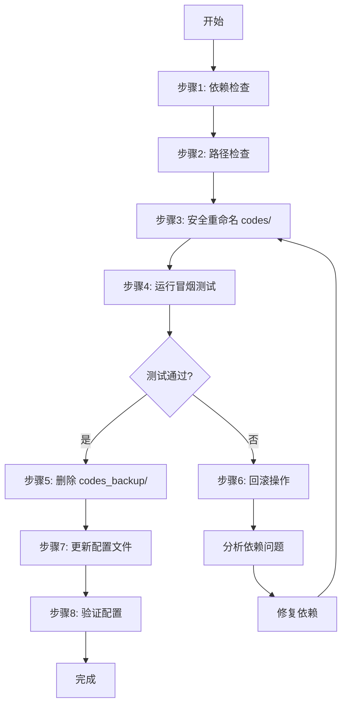

# Design Document: Project Cleanup and Server Adaptation

## Overview

本设计文档针对单人开发、A100 服务器环境以及严格的路径限制，提供项目清理和服务器适配的详细方案。核心目标是：

1. **安全清理冗余代码**：避免误删导致项目崩溃
2. **手动依赖管理**：明确依赖，避免版本冲突
3. **服务器路径适配**：确保所有路径符合 /home/Backup/maziheng 限制
4. **A100 优化配置**：充分利用硬件性能
5. **简化测试策略**：避免过度工程化

### 核心设计原则

1. **安全第一**：所有清理操作可回滚
2. **手动优于自动**：依赖管理手动维护，避免自动化脚本引入问题
3. **实用导向**：测试策略简化，专注核心功能验证
4. **文档驱动**：所有操作有明确文档说明

## Architecture

### 清理和适配流程



### 文件组织结构

清理后的项目结构：

```
/home/Backup/maziheng/medical-image-augmentation-system/
├── src/                    # 核心代码（保留）
│   ├── data/
│   ├── models/
│   ├── training/
│   ├── inference/
│   ├── evaluation/
│   └── app/
├── configs/                # 配置文件（需适配）
│   ├── train_config.yaml
│   └── inference_config.yaml
├── scripts/                # 新增：工具脚本目录
│   ├── check_dependencies.py
│   ├── check_paths.py
│   ├── validate_config.py
│   ├── smoke_test.py
│   └── rollback.py
├── tests/                  # 简化的测试目录
│   ├── test_preprocessing.py
│   └── test_model.py
├── data/                   # 数据目录
├── checkpoints/            # 检查点目录
├── results/                # 结果目录
├── logs/                   # 日志目录
├── examples/               # 示例数据
├── requirements.txt        # 清理后的依赖文件
├── README.md
├── SETUP.md
├── SERVER_SETUP.md         # 新增：服务器配置指南
└── train.py
```

**删除的目录**：
- `codes/` → `codes_backup/` → 删除（测试通过后）
- `codes/environment_RetinaLogos.yml` → 删除

## Components and Interfaces

### 1. 依赖检查脚本 (check_dependencies.py)

**职责**：检查服务器上已安装的包，避免重复安装

**接口**：
```python
def check_installed_packages() -> Dict[str, str]:
    """
    检查已安装的包及其版本
    Returns:
        包名到版本的映射
    """
    pass

def check_pytorch_cuda_compatibility() -> bool:
    """
    检查 PyTorch 和 CUDA 版本是否兼容
    Returns:
        是否兼容
    """
    pass

def list_missing_packages(required: List[str]) -> List[str]:
    """
    列出缺失的包
    Args:
        required: 必需的包列表
    Returns:
        缺失的包列表
    """
    pass

def main():
    """主函数：执行完整的依赖检查"""
    print("=== 依赖检查报告 ===")
    installed = check_installed_packages()
    print(f"已安装包数量: {len(installed)}")
    
    # 检查关键依赖
    key_packages = ['torch', 'torchvision', 'numpy', 'pillow', 'gradio']
    for pkg in key_packages:
        if pkg in installed:
            print(f"✓ {pkg}: {installed[pkg]}")
        else:
            print(f"✗ {pkg}: 未安装")
    
    # 检查 CUDA 兼容性
    if check_pytorch_cuda_compatibility():
        print("✓ PyTorch 和 CUDA 版本兼容")
    else:
        print("✗ PyTorch 和 CUDA 版本不兼容")
```

**实现要点**：
- 使用 `pkg_resources` 或 `importlib.metadata` 获取已安装包
- 使用 `torch.version.cuda` 检查 CUDA 版本
- 不自动安装任何包，仅报告状态

### 2. 路径检查脚本 (check_paths.py)

**职责**：检查配置文件中的路径是否符合服务器限制

**接口**：
```python
def check_yaml_paths(yaml_file: str) -> List[str]:
    """
    检查 YAML 文件中的路径
    Args:
        yaml_file: YAML 文件路径
    Returns:
        不符合规范的路径列表
    """
    pass

def is_valid_path(path: str, allowed_prefix: str = "/home/Backup/maziheng") -> bool:
    """
    检查路径是否有效
    Args:
        path: 待检查的路径
        allowed_prefix: 允许的路径前缀
    Returns:
        是否有效
    """
    pass

def convert_to_relative_path(abs_path: str, base_dir: str) -> str:
    """
    将绝对路径转换为相对路径
    Args:
        abs_path: 绝对路径
        base_dir: 基准目录
    Returns:
        相对路径
    """
    pass

def main():
    """主函数：检查所有配置文件"""
    config_files = [
        'configs/train_config.yaml',
        'configs/inference_config.yaml'
    ]
    
    issues = []
    for config_file in config_files:
        invalid_paths = check_yaml_paths(config_file)
        if invalid_paths:
            issues.append((config_file, invalid_paths))
    
    if issues:
        print("⚠️ 发现路径问题：")
        for file, paths in issues:
            print(f"  {file}:")
            for path in paths:
                print(f"    - {path}")
    else:
        print("✓ 所有路径检查通过")
```

**实现要点**：
- 使用 `yaml.safe_load` 解析配置文件
- 递归检查所有字符串值是否为路径
- 提供路径转换建议

### 3. 配置验证脚本 (validate_config.py)

**职责**：验证配置文件的合理性

**接口**：
```python
def validate_batch_config(batch_size: int, grad_accum_steps: int) -> Tuple[bool, str]:
    """
    验证批次配置
    Args:
        batch_size: 批次大小
        grad_accum_steps: 梯度累积步数
    Returns:
        (是否有效, 错误信息或建议)
    """
    effective_batch_size = batch_size * grad_accum_steps
    
    if batch_size < 4 and grad_accum_steps < 8:
        return False, f"Effective Batch Size ({effective_batch_size}) 过小，建议至少为 32"
    
    if effective_batch_size < 16:
        return False, f"Effective Batch Size ({effective_batch_size}) 过小，可能导致训练不稳定"
    
    return True, f"Effective Batch Size: {effective_batch_size} (合理)"

def estimate_gpu_memory(config: dict) -> float:
    """
    估算 GPU 显存需求（粗略估计）
    Args:
        config: 配置字典
    Returns:
        估算的显存需求（GB）
    """
    # 简化的估算公式
    batch_size = config['training']['batch_size']
    image_size = config['data']['image_size']
    model_dim = config['model']['dim']
    
    # 粗略估算：模型参数 + 激活值 + 优化器状态
    model_memory = model_dim * 32 * 4 / 1e9  # 模型参数（假设 32 层）
    activation_memory = batch_size * image_size * image_size * 4 * 4 / 1e9  # 激活值
    optimizer_memory = model_memory * 2  # 优化器状态
    
    total = model_memory + activation_memory + optimizer_memory
    return total

def main():
    """主函数：验证配置文件"""
    config_file = 'configs/train_config.yaml'
    
    with open(config_file, 'r') as f:
        config = yaml.safe_load(f)
    
    print("=== 配置验证报告 ===")
    
    # 验证批次配置
    batch_size = config['training']['batch_size']
    grad_accum = config['training'].get('gradient_accumulation_steps', 1)
    valid, msg = validate_batch_config(batch_size, grad_accum)
    
    if valid:
        print(f"✓ 批次配置: {msg}")
    else:
        print(f"✗ 批次配置: {msg}")
    
    # 估算显存需求
    memory = estimate_gpu_memory(config)
    print(f"估算显存需求: {memory:.2f} GB")
    
    if memory > 40:
        print("⚠️ 显存需求可能超过 A100 40GB 限制，建议减小 batch_size 或 image_size")
    else:
        print("✓ 显存需求在 A100 40GB 范围内")
```

**实现要点**：
- 检查 Effective Batch Size >= 16（最好 >= 32）
- 粗略估算显存需求
- 提供具体的修改建议

### 4. 冒烟测试脚本 (smoke_test.py)

**职责**：快速验证核心功能是否正常

**接口**：
```python
def test_data_loading():
    """测试数据加载"""
    print("测试数据加载...")
    try:
        from src.data.dataset import ImageDataset
        from src.data.jsonl_loader import load_jsonl
        
        # 使用示例数据
        data = load_jsonl('codes/example_data/example_ver3.json')
        assert len(data) > 0, "数据加载失败"
        
        print("✓ 数据加载测试通过")
        return True
    except Exception as e:
        print(f"✗ 数据加载测试失败: {e}")
        return False

def test_model_initialization():
    """测试模型初始化"""
    print("测试模型初始化...")
    try:
        from src.models.nexdit_mask import NextDiT
        import torch
        
        model = NextDiT(
            patch_size=2,
            in_channels=4,
            mask_channels=1,
            dim=512,  # 小型配置
            n_layers=4,
            n_heads=8
        )
        
        print("✓ 模型初始化测试通过")
        return True
    except Exception as e:
        print(f"✗ 模型初始化测试失败: {e}")
        return False

def test_forward_pass():
    """测试前向传播"""
    print("测试前向传播...")
    try:
        from src.models.nexdit_mask import NextDiT
        import torch
        
        model = NextDiT(
            patch_size=2,
            in_channels=4,
            mask_channels=1,
            dim=512,
            n_layers=4,
            n_heads=8
        )
        
        # 创建随机输入
        x = torch.randn(1, 4, 64, 64)
        t = torch.tensor([0.5])
        cap_feats = torch.randn(1, 77, 512)
        cap_mask = torch.ones(1, 77)
        condition_mask = torch.randn(1, 1, 64, 64)
        
        # 前向传播
        output = model(x, t, cap_feats, cap_mask, condition_mask)
        
        assert output.shape == x.shape, "输出形状不匹配"
        
        print("✓ 前向传播测试通过")
        return True
    except Exception as e:
        print(f"✗ 前向传播测试失败: {e}")
        return False

def main():
    """主函数：运行所有冒烟测试"""
    print("=== 冒烟测试开始 ===\n")
    
    tests = [
        test_data_loading,
        test_model_initialization,
        test_forward_pass
    ]
    
    results = []
    for test in tests:
        results.append(test())
        print()
    
    print("=== 冒烟测试结果 ===")
    passed = sum(results)
    total = len(results)
    print(f"通过: {passed}/{total}")
    
    if passed == total:
        print("✓ 所有测试通过，可以安全删除 codes_backup/")
        return 0
    else:
        print("✗ 部分测试失败，请检查依赖问题")
        return 1

if __name__ == "__main__":
    exit(main())
```

**实现要点**：
- 测试核心功能：数据加载、模型初始化、前向传播
- 使用小型模型配置，快速执行
- 返回明确的退出码（0=成功，1=失败）

### 5. 回滚脚本 (rollback.py)

**职责**：在清理操作失败时恢复原状

**接口**：
```python
def read_cleanup_log(log_file: str = "logs/cleanup.log") -> List[dict]:
    """
    读取清理操作日志
    Args:
        log_file: 日志文件路径
    Returns:
        操作记录列表
    """
    pass

def rollback_operation(operation: dict):
    """
    回滚单个操作
    Args:
        operation: 操作记录
    """
    if operation['type'] == 'rename':
        # 恢复重命名
        os.rename(operation['new_name'], operation['old_name'])
    elif operation['type'] == 'delete':
        # 无法恢复删除，仅警告
        print(f"⚠️ 无法恢复已删除的文件: {operation['path']}")

def main():
    """主函数：执行回滚"""
    print("=== 回滚操作开始 ===")
    
    operations = read_cleanup_log()
    
    if not operations:
        print("没有找到清理操作日志")
        return
    
    print(f"找到 {len(operations)} 个操作记录")
    
    for op in reversed(operations):  # 逆序回滚
        print(f"回滚: {op}")
        rollback_operation(op)
    
    print("✓ 回滚完成")
```

**实现要点**：
- 读取 logs/cleanup.log
- 逆序执行回滚操作
- 对于已删除的文件，仅警告无法恢复

## Data Models

### 清理操作日志格式

```json
{
  "timestamp": "2024-01-01T12:00:00",
  "operations": [
    {
      "type": "rename",
      "old_name": "codes",
      "new_name": "codes_backup",
      "timestamp": "2024-01-01T12:00:01"
    },
    {
      "type": "delete",
      "path": "codes_backup",
      "timestamp": "2024-01-01T12:05:00"
    }
  ]
}
```

### 依赖检查报告格式

```json
{
  "timestamp": "2024-01-01T12:00:00",
  "installed_packages": {
    "torch": "2.0.1",
    "numpy": "1.24.3",
    "pillow": "10.0.0"
  },
  "missing_packages": [
    "gradio",
    "flash-attn"
  ],
  "cuda_compatible": true,
  "warnings": [
    "flash-attn 需要手动编译安装"
  ]
}
```

## Configuration Files

### 清理后的 requirements.txt

```txt
# 核心深度学习框架
torch>=2.0.0
torchvision>=0.15.0

# 图像处理
Pillow>=10.0.0
opencv-python>=4.8.0

# 数值计算
numpy>=1.24.0
scipy>=1.10.0

# 数据处理
PyYAML>=6.0
jsonlines>=3.1.0

# Web 界面
gradio>=4.0.0

# 评估指标
scikit-image>=0.21.0
lpips>=0.1.4

# 工具
tqdm>=4.65.0
tensorboard>=2.13.0

# 测试（可选）
pytest>=7.4.0

# 注意：flash-attn 需要手动安装
# pip install flash-attn --no-build-isolation
```

### 适配后的 train_config.yaml

```yaml
# 模型配置
model:
  name: "NextDiT"
  patch_size: 2
  in_channels: 4
  mask_channels: 1  # 掩码通道数
  dim: 4096
  n_layers: 32
  n_heads: 32

# 训练配置
training:
  batch_size: 2  # A100 40GB 下的安全值
  gradient_accumulation_steps: 16  # 确保 Effective Batch Size = 32
  learning_rate: 1.0e-6
  max_steps: 400000
  mixed_precision: "bf16"  # A100 优化
  checkpoint_interval: 5000
  log_interval: 100
  num_workers: 8  # 充分利用 CPU

# 数据配置
data:
  # 使用相对路径
  train_data: "data/train.jsonl"
  val_data: "data/val.jsonl"
  image_size: 1024
  enable_denoising: false  # 数据集已预处理

# 输出配置
output:
  # 使用相对路径
  checkpoint_dir: "./checkpoints"
  log_dir: "./logs"

# 路径说明：
# - 所有路径使用相对路径，相对于项目根目录
# - 项目根目录应位于 /home/Backup/maziheng/
# - 示例：/home/Backup/maziheng/medical-image-augmentation-system/

# Effective Batch Size 计算：
# Effective Batch Size = batch_size × gradient_accumulation_steps
# 当前配置：2 × 16 = 32
# 建议：Effective Batch Size >= 32 以确保训练稳定
```

## Implementation Strategy

### 执行步骤

#### 步骤 1: 依赖检查（5 分钟）

```bash
# 1. 运行依赖检查脚本
python scripts/check_dependencies.py

# 2. 根据报告手动安装缺失的包
pip install <missing_package>

# 3. 手动安装 flash-attn（如果需要）
pip install flash-attn --no-build-isolation
```

#### 步骤 2: 路径检查（5 分钟）

```bash
# 1. 运行路径检查脚本
python scripts/check_paths.py

# 2. 根据报告手动修改配置文件
# 将绝对路径改为相对路径或 /home/Backup/maziheng 前缀
```

#### 步骤 3: 安全重命名（1 分钟）

```bash
# 1. 重命名 codes/ 为 codes_backup/
mv codes codes_backup

# 2. 记录操作到日志
echo "$(date): Renamed codes to codes_backup" >> logs/cleanup.log
```

#### 步骤 4: 冒烟测试（2 分钟）

```bash
# 运行冒烟测试
python scripts/smoke_test.py

# 如果测试通过，继续下一步
# 如果测试失败，执行回滚
```

#### 步骤 5: 删除备份（1 分钟）

```bash
# 仅在冒烟测试通过后执行
rm -rf codes_backup

# 记录操作到日志
echo "$(date): Deleted codes_backup" >> logs/cleanup.log
```

#### 步骤 6: 配置验证（2 分钟）

```bash
# 验证配置文件
python scripts/validate_config.py

# 根据建议调整配置
```

#### 步骤 7: 最终验证（5 分钟）

```bash
# 运行完整的测试套件
python -m pytest tests/

# 或者仅运行核心测试
python tests/test_preprocessing.py
python tests/test_model.py
```

### 回滚流程（如果需要）

```bash
# 执行回滚
python scripts/rollback.py

# 检查项目结构
ls -la

# 重新运行冒烟测试
python scripts/smoke_test.py
```

## Testing Strategy

### 简化的测试策略

**核心原则**：避免过度工程化，专注实用性

#### 1. 冒烟测试（Smoke Test）

- **目的**：快速验证核心功能
- **工具**：自定义 smoke_test.py
- **覆盖**：数据加载、模型初始化、前向传播
- **执行时间**：< 2 分钟

#### 2. 单元测试（Unit Test）

- **目的**：验证关键函数的正确性
- **工具**：pytest
- **覆盖**：数据预处理、模型组件
- **执行时间**：< 5 分钟

**不包含**：
- ❌ Hypothesis 属性测试（过度工程化）
- ❌ 集成测试（毕设阶段不必要）
- ❌ 性能测试（A100 性能足够）

### 测试文件示例

**tests/test_preprocessing.py**:
```python
import pytest
from src.data.preprocessing import preprocess_image, preprocess_mask

def test_image_resize():
    """测试图像调整大小"""
    from PIL import Image
    import torch
    
    image = Image.new('RGB', (1024, 768))
    result = preprocess_image(image, target_size=512)
    
    assert isinstance(result, torch.Tensor)
    assert result.shape == (3, 512, 512)

def test_mask_resize():
    """测试掩码调整大小"""
    import torch
    
    mask = torch.randint(0, 5, (256, 256))
    result = preprocess_mask(mask, target_size=512)
    
    assert result.shape == (512, 512)
    assert result.dtype in [torch.int, torch.long]
```

## Documentation Updates

### SERVER_SETUP.md（新增）

```markdown
# 服务器环境配置指南

## 环境限制

- **服务器路径限制**：仅能在 `/home/Backup/maziheng` 操作
- **GPU**：NVIDIA A100 40GB
- **Python**：3.10+
- **CUDA**：11.8+

## 快速启动

### 1. 克隆项目

```bash
cd /home/Backup/maziheng
git clone <repo_url> medical-image-augmentation-system
cd medical-image-augmentation-system
```

### 2. 检查依赖

```bash
python scripts/check_dependencies.py
```

### 3. 安装缺失依赖

```bash
# 安装常规依赖
pip install -r requirements.txt

# 手动安装 flash-attn（可选，但强烈推荐）
pip install flash-attn --no-build-isolation
```

### 4. 清理项目结构

```bash
# 安全重命名
mv codes codes_backup

# 运行冒烟测试
python scripts/smoke_test.py

# 如果测试通过，删除备份
rm -rf codes_backup
```

### 5. 验证配置

```bash
python scripts/validate_config.py
```

### 6. 开始训练

```bash
python train.py --config configs/train_config.yaml
```

## 常见问题

### Q: flash-attn 安装失败？

A: flash-attn 需要编译，确保安装了 CUDA 开发工具：
```bash
nvcc --version  # 检查 CUDA 版本
pip install flash-attn --no-build-isolation
```

### Q: 显存不足（OOM）？

A: 减小 batch_size 或 image_size：
```yaml
training:
  batch_size: 1  # 从 2 减小到 1
  gradient_accumulation_steps: 32  # 相应增加
```

### Q: 路径错误？

A: 确保所有路径使用相对路径或 `/home/Backup/maziheng` 前缀。
```

## Error Handling

### 清理操作错误处理

1. **codes/ 重命名失败**：
   - 检查文件权限
   - 检查是否有进程占用

2. **冒烟测试失败**：
   - 检查依赖是否完整安装
   - 检查 src/ 是否有隐式依赖 codes/
   - 执行回滚操作

3. **配置验证失败**：
   - 根据具体错误信息调整配置
   - 参考 SERVER_SETUP.md 中的建议

### 依赖安装错误处理

1. **版本冲突**：
   - 手动卸载冲突的包
   - 按照 requirements.txt 重新安装

2. **flash-attn 编译失败**：
   - 检查 CUDA 版本
   - 检查 gcc 版本
   - 如果无法解决，可以跳过（性能会降低）

## Implementation Notes

### 关键注意事项

1. **不要自动化依赖安装**：手动安装可以避免版本冲突
2. **不要直接删除 codes/**：先重命名，测试通过后再删除
3. **不要过度测试**：冒烟测试 + 简单单元测试即可
4. **不要忽略配置验证**：Effective Batch Size 必须合理

### 时间估算

- 依赖检查和安装：10-15 分钟
- 项目清理：5-10 分钟
- 配置适配：5-10 分钟
- 测试验证：5-10 分钟
- **总计**：25-45 分钟

### 成功标志

- ✓ 冒烟测试全部通过
- ✓ 配置验证无警告
- ✓ codes/ 目录已删除
- ✓ 所有路径使用相对路径或服务器限制路径
- ✓ 文档已更新
