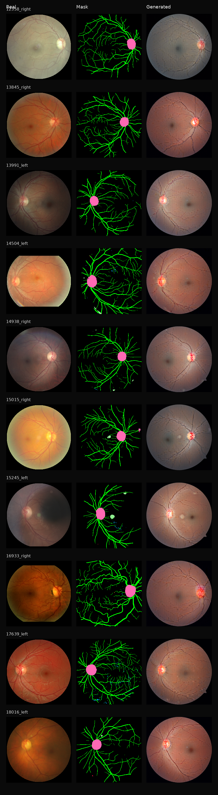

# 基于多模态信息融合的医学影像增广系统的设计与实现

## 中文摘要

高质量医学影像数据的不足限制了智能诊断模型在真实场景中的应用，尤其在眼底图像任务中，病灶稀疏、结构复杂、标注成本高等问题使传统数据增广难以满足模型训练需求。现有生成式方法虽然能够合成外观自然的医学图像，但在解剖结构、病理语义和成像风格之间保持一致仍具有挑战。针对上述问题，本文围绕“基于多模态信息融合的医学影像增广系统的设计与实现”开展研究，构建一套融合图像、结构掩膜和病理文本的可控眼底图像增广系统。

本文首先对公开眼底图像、融合结构掩膜和自动生成的病理描述进行统一组织，形成面向训练、推理和评估的多模态样本表示。在此基础上，设计图像质量筛选、结构掩膜几何质控和字段化 caption 整理流程，提升训练数据的可信度与可追溯性。针对眼底生成中常见的全局色调漂移问题，本文进一步构建颜色风格标签，将整体底色、背景清晰度、对比度和周边暗角等成像特征显式写入文本条件，使模型能够同时接收结构约束、病理语义和颜色风格信息。

在方法层面，本文以 RetinaLogos 文本驱动眼底图像生成框架为基础，引入融合结构掩膜作为空间先验，并提出“全局底图生成、局部病灶编辑、一致性筛选”的分层式增广路线。全局阶段重点学习视盘位置、血管走向、眼底纹理和颜色风格，局部阶段面向微动脉瘤、出血和渗出等小病灶增强细节表达，筛选阶段通过结构和颜色指标辅助判断生成样本的可靠性。系统实现方面，本文完成了多模态数据管理、训练调度、自动评估、三联对照图生成和可视化原型等模块，形成了可复现、可扩展的科研原型系统。

实验与可视化结果表明，本文提出的多模态条件路线能够显著改善旧式单一路线中存在的结构不稳定、视盘位置异常和颜色偏移等问题。经过结构与颜色硬性门槛评估，本文最终选择训练至 `1000` 步的 Stage A colorfix adapter 作为系统默认权重；继续从该权重训练至 `1500` 至 `5000` 步的候选模型虽然完成评估，但均未同时满足结构不退化和颜色不偏移要求。最终生成结果在血管走向、视盘侧别、病灶区域和全局色调方面表现出更好的可控性，说明结构掩膜、病理文本与颜色风格条件的联合建模能够提升眼底增广样本的医学合理性与视觉自然性。本文工作为受控医学影像生成和下游诊断数据增广提供了一套可落地的系统实现方案。

**关键词：** 多模态信息融合；医学影像增广；眼底图像；扩散模型；结构先验；病理文本；系统设计与实现

## English Abstract

The shortage of high-quality medical imaging data limits the deployment of intelligent diagnostic models in real clinical scenarios. This issue is particularly prominent in fundus imaging, where lesions are sparse, anatomical structures are complex, and expert annotation is costly. Although recent generative models can synthesize visually plausible medical images, it remains challenging to maintain consistency among anatomical layout, pathological semantics, and imaging style. To address this challenge, this thesis studies the design and implementation of a multimodal medical image augmentation system for controllable fundus image synthesis.

The proposed system organizes fundus images, fusion structural masks, and automatically generated pathological captions into a unified multimodal representation for training, inference, and evaluation. Image quality filtering, mask geometry quality control, and structured caption processing are designed to improve the reliability and traceability of training samples. To reduce global color drift in fundus generation, color-style tags are further introduced into the captions, explicitly describing global tone, background clarity, contrast, and peripheral darkening. In this way, the generator receives structural constraints, pathological semantics, and appearance-style cues through a unified conditioning interface.

Methodologically, this thesis adapts RetinaLogos to the current multimodal augmentation task by incorporating fusion masks as spatial priors and designing a hierarchical augmentation route consisting of global fundus generation, local lesion editing, and consistency screening. The global stage focuses on optic disc location, vessel layout, retinal texture, and color style, while the local stage is designed to enhance fine-grained lesions such as microaneurysms, hemorrhages, and exudates. The screening stage evaluates generated samples using structural and color-related metrics. On the implementation side, the system integrates multimodal data management, training orchestration, automatic evaluation, triptych rendering, and a visualization prototype into a reproducible research pipeline.

Experimental and visual analyses show that the proposed multimodal conditioning route substantially improves the structural stability, optic disc localization, lesion-region controllability, and global color style of generated fundus images compared with the earlier baseline route. Based on a strict structural and color guard, the system finally selects the Stage A colorfix adapter trained for `1000` steps as the default checkpoint; continuation candidates from `1500` to `5000` steps were evaluated but rejected because they did not simultaneously preserve structure and color fidelity. The results indicate that jointly modeling structural masks, pathological captions, and color-style conditions can improve the medical plausibility and visual naturalness of synthetic fundus images. This work provides a practical system-level solution for controllable medical image synthesis and downstream data augmentation.

**Keywords:** multimodal information fusion; medical image augmentation; fundus imaging; diffusion model; structural prior; pathological caption; system design and implementation

---

# 第1章 绪论

## 1.1 研究背景

近年来，深度学习在智慧医疗、辅助诊断、病灶识别和风险预测等任务中取得了显著进展，但其性能高度依赖大规模且高质量的训练数据。与自然图像相比，医学影像数据不仅采集成本更高，而且对标注精度、结构合理性和临床解释性提出了更严格的要求。在眼底图像场景中，糖尿病视网膜病变、黄斑病变和青光眼等疾病通常依赖对血管树、视盘、黄斑以及细粒度病灶的联合观察完成判读，因此数据的结构完整性与病理语义一致性直接影响模型训练效果。

现有医学影像数据增广方法主要包括旋转、翻转、裁剪、颜色扰动等传统增强手段。这类方法虽然实现简单，但只能对已有样本做低阶变换，无法生成新的病灶布局和新的结构组合。近年来，扩散模型和视觉语言模型的发展使“基于文本或结构条件直接生成医学影像”成为可能，但在医学场景下，若条件约束不足，生成结果容易出现解剖关系错误、病灶位置漂移、颜色分布异常等问题，难以直接作为可靠增广样本用于训练。

眼底图像任务的一个重要特点在于其天然具有多模态属性。一次完整的样本通常至少包含三类信息：原始彩色眼底图像、关键解剖结构或病灶的分割结果，以及对病理表现的文字描述。原始图像提供纹理与成像风格，结构掩膜提供空间先验，病理文本提供医学语义。如果能够将三者统一纳入同一增广系统，则有望生成同时满足结构合理性、病理一致性和视觉自然性的合成样本，从而提升增广数据的实际可用性。

## 1.2 研究意义

本文的研究意义主要体现在三个方面。

首先，在理论层面，本文尝试将图像模态、结构模态和文本模态统一到一个受控生成框架中，探索结构先验与病理语义联合约束扩散模型的可行性。这一思路有助于推动医学影像生成从“只关注视觉相似”走向“同时关注医学逻辑一致性”的更深层阶段。

其次，在方法层面，本文将全图结构控制、颜色风格条件和局部病灶编辑任务拆分为不同阶段处理，避免将“全局 anatomy 建模、全局颜色建模和 tiny lesion 建模”全部压缩到一个全图模型中。这种分层式设计更符合眼底图像的空间尺度特征，也为可控生成任务提供了更清晰的工程路线。

最后，在应用层面，本文面向“系统设计与实现”这一毕设目标，完成了数据清洗、元数据组织、模型训练、结构评估、对照图生成和可视化原型等模块，形成了较完整的系统闭环。该系统既能用于实验研究，也能作为后续扩展下游诊断任务的数据生产工具。

## 1.3 国内外研究现状

### 1.3.1 传统医学影像增广研究

传统增广通常通过几何变换和像素扰动扩充样本，包括翻转、旋转、裁剪、亮度变化、模糊与噪声扰动等。这类方法在分类任务中能够缓解小样本问题，但无法创造新的结构与病灶分布，因此其对复杂病灶表达的帮助有限。对于糖尿病视网膜病变任务而言，微动脉瘤、点片状出血和渗出灶等病灶本身具有明显的尺度差异与空间稀疏性，传统增广无法真正补齐这些病灶在训练分布中的不足。

### 1.3.2 生成式医学影像增广研究

生成对抗网络、变分自编码器和扩散模型推动了医学影像合成的发展。相较传统方法，生成式模型能够直接学习图像分布并产生新的样本，从而更适合医学影像增广。但已有方法往往存在两个问题：一是条件控制不够精细，容易生成“看起来像眼底图，但解剖细节不可信”的结果；二是模型对稀疏小病灶的表达能力不足，容易出现整体结构合理而局部病灶丢失的情况。

### 1.3.3 文本驱动的眼底图像生成研究

在眼底图像合成方向，Ning 等提出 RetinaLogos，通过视觉语言模型生成大规模眼底图像描述，并在超过 `140` 万对图文数据上训练文本驱动的眼底图像生成模型。该方法采用冻结的 `Google Gemma 2B` 文本解码器提取文本嵌入，并基于 latent flow-matching DiT 完成高分辨率眼底图像生成。RetinaLogos 证明了文本到眼底图像生成在细粒度语义控制方面的潜力，也为本文选择其作为基座模型提供了直接依据。

不过，RetinaLogos 主要围绕“高质量文本驱动眼底图像生成”展开，而本文面对的是“多模态医学影像增广系统”的实现问题。与其直接复制原方法相比，本文更关注以下三点本地化改造：一是引入融合结构掩膜作为显式空间先验；二是针对现有公开数据重新构建高可信元数据；三是增加结构评估、颜色风格控制和局部病灶编辑路线，使系统更适合作为增广平台使用。

### 1.3.4 多模态可控生成研究不足

综合现有工作可以发现，当前研究在三个方面仍存在不足。

1. 缺少可直接落地到医学增广系统的多模态工程闭环。许多工作强调模型本身，但对数据组织、系统原型和结果验证讨论不足。
2. 对 tiny lesion 建模关注不够。全图统一建模时，微小病灶往往被更强的背景和大结构信号淹没。
3. 颜色与结构常常被混合处理，缺少稳定的全局风格控制机制，容易导致生成图像出现发紫、发绿或边缘异常等问题。

因此，本文的工作重点不是简单复现文本生图模型，而是在基座模型之上构建适用于眼底医学影像增广的多模态系统。

## 1.4 研究内容与目标

围绕课题要求，本文的研究内容包含四个方面。

1. 医学影像数据收集与预处理。围绕公开眼底图像、融合结构掩膜和自动生成 caption 构建多源数据场景，并通过质量清洗和几何质控提升样本可靠性。
2. 结构信息与语义文本的融合建模。将血管、视盘和多类病灶作为结构先验，并将结构化病理文本与全局颜色风格标签共同纳入条件输入。
3. 生成式医学影像增广方法构建。以 RetinaLogos 为基座，设计从全局底图生成到局部病灶编辑的分层增广路线。
4. 增广系统实现与效果评估。实现训练、评估、对照图渲染和 Gradio 原型展示，并基于结构一致性和颜色误差给出量化分析。

本文的目标并不是生成“外观像眼底图”的图片，而是生成“结构上说得通、病理上对得上、颜色上尽可能自然”的眼底增广样本。

## 1.5 研究方法与技术路线

本文总体技术路线如图 1-1 所示。系统首先对公开眼底图像进行质量清洗和 mask 几何质控，然后将原图、融合结构掩膜和结构化 caption 组织为统一 JSONL 元数据；随后基于 RetinaLogos 构建结构约束下的全局生成主线，并在此基础上扩展局部病灶裁剪与一致性筛选模块；最后通过结构评估、三联对照图和可视化原型完成闭环验证。

图 1-1 总体技术路线图

## 1.6 本文的主要工作与创新点

本文的主要工作与创新点可以归纳为以下四点。

1. 构建了一个围绕图像、结构和文本三类信息统一组织的眼底多模态训练数据流程，并给出了可追溯的两级清洗标准。
2. 在 RetinaLogos 文本生图框架基础上，引入融合结构掩膜、几何对齐和 `COLOR_STYLE` 风格标签，使生成条件更加适应医学影像增广任务。
3. 提出“Stage A 全局底图生成 + Stage B 局部病灶编辑 + Stage C 一致性筛选”的分层路线，以缓解 tiny lesion 被全图背景淹没的问题。
4. 实现了从数据准备、训练、评估到 Gradio 原型展示的系统闭环，而不是停留在单模型实验层面。

## 1.7 论文结构安排

全文共分为七章。

第 1 章介绍研究背景、研究意义、国内外研究现状以及本文的研究目标与创新点。  
第 2 章总结相关理论与关键技术，包括扩散模型、多模态条件控制和眼底图像生成基座模型。  
第 3 章介绍数据来源、数据清洗、结构掩膜语义设计以及多模态训练样本构建过程。  
第 4 章阐述基于多模态信息融合的医学影像增广方法，包括全局生成、局部编辑和一致性筛选。  
第 5 章介绍系统总体设计与实现细节，包括模块架构、文件组织和可视化原型。  
第 6 章给出实验设计、结果分析和失败案例讨论。  
第 7 章总结全文并展望后续工作。

---

# 第2章 相关理论与关键技术

## 2.1 扩散模型与潜空间生成

扩散模型通过逐步向样本添加噪声并学习反向去噪过程来逼近数据分布，近年来在高分辨率图像生成任务中展现出较强的稳定性与可扩展性。与 GAN 相比，扩散模型更适合在复杂条件下进行可控生成；与直接像素空间建模相比，潜空间生成可以显著降低显存占用，使 512×512 甚至更高分辨率的医学图像生成成为可能。

本文采用的基座 RetinaLogos 使用 latent flow-matching DiT 作为主生成器，在潜空间中学习噪声到图像表示的映射，并通过冻结的文本解码器获得提示词嵌入。该路线一方面继承了大规模文本生图模型的表达能力，另一方面也为结构条件的附加提供了较好的可扩展接口。

## 2.2 医学影像中的结构先验

结构先验指在生成或分析过程中显式引入器官轮廓、关键解剖结构或病灶位置等空间信息。对眼底图像而言，视盘位置、血管树形态、黄斑区域和病灶分布共同决定了一张图像是否具有医学可信度。若不引入结构先验，模型虽然可能生成整体上看似自然的眼底图像，但其视盘侧别、血管走向与病灶空间关系往往难以与医学逻辑保持一致。

因此，本文采用融合结构掩膜作为统一空间条件，将 `vessels`、`optic_disc`、`hemorrhages`、`soft_exudates`、`exudates` 和 `microaneurysms` 六类结构或病灶统一编码，以此为后续条件生成与结构评估提供共享语义空间。

## 2.3 病理文本与多模态语义约束

文本模态在本文中承担两个功能：一是补充病灶类型、严重程度和局部分布等结构掩膜无法完整表达的医学语义；二是作为生成模型的高层条件，帮助模型学习图像内容与临床描述之间的对应关系。与自由自然语言相比，结构化病理字段更有利于稳定训练和结果审查，因此本文采用字段化 caption 组织方式，将 `MICROANEURYSMS`、`HEMORRHAGES`、`EXUDATES`、`SOFT_EXUDATES`、`OPTIC_DISC` 和 `VESSELS` 等字段显式写入文本。

后续针对颜色偏移问题，本文又引入 `COLOR_STYLE` 前缀，将整体色调、背景清晰度、对比度和周边暗角风格作为额外文本条件，使原先“只靠 mask 和病理描述，难以约束整体底色”的问题得到缓解。

## 2.4 RetinaLogos 基座模型及其适配思路

根据基座论文《RetinaLogos: Fine-Grained Synthesis of High-Resolution Retinal Images Through Captions》，该方法的核心特点包括：

1. 利用视觉语言模型为眼底图像生成细粒度 caption。
2. 构建大规模图文对数据集，以支持文本驱动的眼底图像生成。
3. 使用 latent flow-matching DiT 和冻结的 `Google Gemma 2B` 文本解码器完成训练。
4. 通过多阶段训练实现低分辨率预训练到高分辨率微调的迁移。

本文并未直接复现其整套数据生产流程，而是在其文本生图能力基础上完成任务适配。主要差异如下：

1. 本文的数据来源限定为公开 Kaggle 眼底图像子集，而非基座论文中的超大规模混合数据。
2. 本文将融合结构掩膜作为新增条件，与文本提示共同构成多模态输入。
3. 本文更强调“系统设计与实现”，因此增加了数据清洗、几何质控、结构评估和可视化原型等工程模块。

## 2.5 分层生成思想

从当前实验经验看，将“全局解剖结构、全局颜色风格和极小病灶”全部交由一个全图模型同时学习，会显著增加训练难度。前期 parser-centered 路线已经证明，仅依赖统一全图监督和冻结解析器难以稳定学习 tiny lesion。基于这一认识，本文采用分层生成思想：

1. 在全局层先稳定学习眼底底图，包括视盘、血管、整体纹理和颜色风格。
2. 在局部层再通过 lesion-centric crop 数据强化四类病灶的细粒度外观表达。
3. 在输出层使用结构评估和人工审查完成筛样。

该思想是本文方法设计和系统实现的核心出发点。

---

# 第3章 数据构建与预处理

## 3.1 数据来源

本文使用的多模态数据由三部分组成：

1. 原始眼底图像来自 Kaggle `Diabetic Retinopathy Detection` 数据集，在其中选择具备后续处理条件的样本。
2. 融合结构掩膜由课题组前序工作提供，包含视盘、血管和四类病灶的统一语义编码。
3. 病理 caption 由 Qwen 多模态模型针对每张眼底图像自动生成，并经脚本整理为字段化描述。

表 3-1 多模态数据来源

| 数据模态 | 来源 | 在本文中的作用 |
| --- | --- | --- |
| 原始眼底图像 | Kaggle `Diabetic Retinopathy Detection` | 提供真实图像纹理与成像分布 |
| 融合结构掩膜 | 课题组前序工作 | 提供视盘、血管与病灶结构先验 |
| 病理 caption | Qwen 多模态模型生成 | 提供病灶语义和全局描述条件 |

## 3.2 统一元数据组织方式

为支撑后续训练与系统实现，本文采用 JSONL 作为统一元数据格式，每条记录至少包含以下字段：

1. `id`：样本唯一标识，包含左右眼信息；
2. `image`：原始眼底图像路径；
3. `mask`：对应的融合结构掩膜路径；
4. `caption`：结构化病理文本；
5. `caption_source`、`mask_name`、`image_size` 等辅助字段。

在引入颜色风格控制后，元数据中进一步增加了 `color_style_code`、`color_style_prompt` 和 `caption_compact_tokens` 等字段，从而使同一份数据既适用于训练，也适用于推理和实验分析。

## 3.3 样本筛选与质量清洗

### 3.3.1 初始样本整理

按照项目工作流，完整候选元数据起点为 `metadata_train_full.jsonl`，共 `18789` 条记录。该候选集来源于原始图像、已有 mask 与自动生成 caption 的统一对齐结果，但并非所有样本都能直接用于训练。部分样本存在图像质量异常、边缘炫光严重、视盘缺失、mask 超出标准圆形视野、左右眼视盘方向不一致等问题，需要进一步清洗。

### 3.3.2 图像质量清洗

在图像质量层面，系统首先使用自动脚本对每张眼底图像计算以下指标：

1. 视野边缘与中心区域的绿色通道差值；
2. 视野边缘与中心区域的蓝色通道差值；
3. 边缘亮度与中心亮度比值；
4. 视野亮度分布的 `p99.5` 分位数；
5. 基于中值滤波差分得到的噪声水平。

这些指标分别用于检测绿色炫光、蓝色炫光、过亮边缘、整体过曝和高噪声样本，从而剔除对生成模型有显著破坏作用的极端异常图像。

表 3-2 图像质量清洗核心阈值

| 指标 | 阈值 |
| --- | ---: |
| `max_edge_green` | 0.08 |
| `max_edge_blue` | 0.05 |
| `max_edge_luma_ratio` | 1.12 |
| `max_p995_luma` | 0.86 |
| `max_noise` | 0.0045 |

### 3.3.3 清洗后训练集规模

在质量清洗和已知 clean 清单合并后，主训练候选数据由 `18789` 条收敛为 `11331` 条。其中 `11026` 条来自主 clean 集，另外 `305` 条为补充保留的无明显病灶但质量合格的样本，用于防止训练集过度偏向病灶阳性样本。

表 3-3 训练集规模变化

| 阶段 | 样本数 |
| --- | ---: |
| 初始候选元数据 | 18789 |
| 主 clean 样本 | 11026 |
| 补充 clean 样本 | 305 |
| 质量清洗后输出 | 11331 |

## 3.4 mask 几何质控

在眼底图像任务中，结构掩膜不仅要“有标注”，还要满足几何合理性。为此，本文进一步对 `11331` 条质量清洗后的样本执行 mask geometry QC，重点检查以下问题：

1. 掩膜是否为正方形；
2. 非零区域是否明显超出标准圆形视野；
3. 血管像素数和血管横纵跨度是否过低；
4. 视盘是否缺失；
5. 视盘面积是否过小或过大；
6. 视盘是否过于靠近边缘；
7. 视盘左右侧别是否与样本 `id` 中的 `_left/_right` 一致。

对应阈值如表 3-4 所示。

表 3-4 mask 几何质控阈值

| 指标 | 阈值 |
| --- | ---: |
| 最小视盘面积占比 | 0.008 |
| 最大视盘面积占比 | 0.035 |
| 最小视盘边界裕量 | 0.12 |
| 最小血管像素数 | 1200 |
| 最小血管横向跨度 | 0.82 |
| 最小血管纵向跨度 | 0.82 |
| 最大圆外非零占比 | 0.12 |

几何质控执行后，训练集由 `11331` 条进一步压缩到 `5246` 条，剔除 `6085` 条问题样本。由于一条记录可能同时命中多个问题，原因计数之间并非互斥。主要剔除原因统计如表 3-5 所示。

表 3-5 训练集几何质控主要剔除原因统计

| 原因 | 命中次数 |
| --- | ---: |
| `mask_outside_canonical_circle` | 3236 |
| `optic_disc_laterality_mismatch` | 3186 |
| `optic_disc_too_close_to_edge` | 2491 |
| `optic_disc_missing` | 1159 |
| `vessel_span_x_too_narrow` | 866 |
| `optic_disc_too_small` | 723 |
| `vessel_span_y_too_narrow` | 119 |
| `optic_disc_too_large` | 89 |
| `vessel_too_sparse` | 21 |

进一步统计可得，最终主训练集包含左眼 `2585` 条、右眼 `2661` 条，共 `5246` 条；用于快速结构评估的 holdout 示例集则由 `20` 条筛至 `10` 条。

## 3.5 融合结构掩膜语义设计

本文使用的 fusion mask 将六类结构或病灶统一编码到同一张 RGB 掩膜图中。这样设计有两个优点：一是便于模型直接读取多类空间条件；二是便于后续评估脚本在统一语义体系下计算结构一致性指标。

表 3-6 融合结构掩膜语义编码

| 语义类别 | 在系统中的作用 |
| --- | --- |
| `vessels` | 约束血管主走向和分支布局 |
| `optic_disc` | 约束视盘位置与大小 |
| `hemorrhages` | 表示出血病灶 |
| `soft_exudates` | 表示软性渗出病灶 |
| `exudates` | 表示硬性渗出病灶 |
| `microaneurysms` | 表示微动脉瘤病灶 |

图 3-1 图像预处理与视野规整示意图

图 3-2 融合结构掩膜示例图

## 3.6 结构化 caption 设计

在文本组织方面，本文没有直接保留完全自由的自然语言描述，而是对 Qwen 生成结果做了字段化整理。整理后 caption 主要包含以下字段：

1. `MICROANEURYSMS`
2. `HEMORRHAGES`
3. `EXUDATES`
4. `SOFT_EXUDATES`
5. `MACULA_FOVEA`
6. `OPTIC_DISC`
7. `VESSELS`
8. `IMPRESSION`

字段化组织的好处在于，局部病灶数据构建脚本可以直接解析对应字段，从而判断文本是否支持某类病灶的正向存在，避免 mask 中有病灶而 caption 中写成 `absent` 的语义冲突。

## 3.7 颜色风格标签构建

针对前期实验中出现的全局色调偏紫问题，本文进一步对训练集进行颜色风格聚类，将整体眼底底色、背景清晰度、对比度和周边暗角等信息概括为 `8` 个 `COLOR_STYLE` 风格标签，并将其以前缀形式写入 caption。例如：

`COLOR_STYLE: style_03, medium green-tinged beige, clear background, soft contrast, moderate peripheral darkening.`

加入该字段后，模型在推理阶段仍然只需要 `mask + caption` 作为输入，但 caption 中已显式携带整体底色风格信号，从而增强颜色可控性。后续实验进一步发现，颜色提示在文本中的位置会影响模型对风格条件的利用效果，因此本文将 `COLOR_STYLE` 固定放在 caption 起始位置，再接入左右眼和解剖结构提示，使颜色风格、空间结构和病理语义在同一文本条件中形成稳定顺序。

图 3-3 八类颜色风格聚类示例图

## 3.8 lesion-centric crop 数据构建

为解决 tiny lesion 难生成问题，本文额外构建局部病灶裁剪数据。具体做法如下：

1. 根据 fusion mask 中四类病灶颜色提取连通域；
2. 以连通域为中心生成带上下文的正方形 crop；
3. 同步裁剪原图、fusion mask 和 lesion binary mask；
4. 从全局 caption 中解析对应病灶字段，构造局部 `local_caption`。

该流程由 `build_lesion_crop_dataset.py` 实现，当前已构建 `29439` 条局部样本。各病灶类型数量如表 3-7 所示。

表 3-7 lesion-centric crop 数据规模

| 病灶类别 | 样本数 |
| --- | ---: |
| hemorrhages | 9436 |
| soft_exudates | 3002 |
| exudates | 12033 |
| microaneurysms | 4968 |
| 合计 | 29439 |

该数据集为后续 Stage B 局部病灶编辑模块提供了训练基础，也是本文区别于纯文本生图路线的重要数据层创新。

## 3.9 本章小结

本章围绕数据构建与预处理展开，完成了公开数据来源说明、统一元数据设计、图像质量清洗、mask 几何质控、结构化 caption 整理、颜色风格标签构建以及局部病灶裁剪数据构建。可以看出，本文并非直接将原始公开数据送入训练，而是通过逐层质控与结构化组织，为后续多模态增广提供了可靠的数据基础。

---

# 第4章 基于多模态信息融合的医学影像增广方法

## 4.1 问题定义

本文面向的任务是：在给定融合结构掩膜和病理语义文本的条件下，生成一张结构合理、病理一致并具有自然色调的彩色眼底图像。与普通文本生图任务不同，本文的目标不是追求“视觉上看起来像一张图片”，而是要求生成样本满足以下三重一致性：

1. 图像域一致性：整体外观接近真实眼底图像分布；
2. 结构域一致性：视盘、血管和病灶位置与结构掩膜对齐；
3. 语义域一致性：文本描述中的病灶类型与图像表现一致。

## 4.2 基座模型选择

本文选择 RetinaLogos 作为基座模型，主要基于以下原因：

1. RetinaLogos 已证明文本驱动高分辨率眼底图像生成是可行的；
2. 其主干使用 latent flow-matching DiT，具备较好的高分辨率建模能力；
3. 其文本编码依赖冻结的 `Google Gemma 2B`，适合字段化病理 caption 输入；
4. 当前项目代码已在本地完成 RetinaLogos 框架实现，便于继续做任务适配。

但本文并不是直接沿用其“纯 caption 生成”路径，而是在其基础上增加结构先验和系统评估模块，使之适配多模态医学影像增广任务。

## 4.3 多模态条件设计

### 4.3.1 结构条件

结构条件由 fusion mask 提供，包含视盘、血管以及四类病灶的空间信息。在训练中，结构条件不只是辅助显示，而是通过独立的结构控制分支参与全图生成。对模型而言，mask 提供的是“哪里应该出现什么”的先验。

### 4.3.2 文本条件

文本条件由结构化 caption 提供。与自由文本相比，字段化 caption 更适合训练和调试。为进一步适应训练资源限制，系统使用紧凑版 caption，并在 `tokenizer` 中设置 `max_length=256` 与 `truncation=True`，尽量保证重要语义字段不被过度截断。

### 4.3.3 颜色条件

颜色条件通过 `COLOR_STYLE` 标签注入。与直接修改网络输入接口相比，这种做法不需要改动基座模型结构，而是在原有 `mask + caption` 推理接口基础上增强 caption 的全局色调表达能力。为避免颜色信息被后续结构提示稀释，本文在训练样本处理阶段保持 `COLOR_STYLE` 置顶，并对文本条件桥接模块设置独立学习率，使模型在学习血管、视盘和病灶结构的同时，也能更快利用全局成像风格信息。

## 4.4 从旧路线到新路线的设计演化

前期实验曾采用 parser-centered 旧路线，即通过冻结结构解析器为全图生成器提供额外监督。但工作记录显示，该路线在 tiny lesion 表达方面长期表现不佳，且容易引入全局颜色失真。基于此，本文将主线调整为：

1. Stage A：全局底图生成  
   重点学习视盘位置、血管树走向、整体纹理和颜色分布；
2. Stage B：局部病灶编辑  
   借助 lesion-centric crop 数据强化四类病灶的细节表达；
3. Stage C：一致性筛选  
   通过结构评估和人工审查过滤不可靠样本。

这种调整的核心思想是将“大结构建模”和“小病灶建模”拆开处理，避免在单一全图模型中相互干扰。

## 4.5 Stage A：全局底图生成

Stage A 使用 `fullmask + caption + color style` 作为条件，在严格几何对齐后的标准视野空间中训练全图生成器。其主要目标包括：

1. 稳定生成具有正确视盘侧别和血管主走向的眼底底图；
2. 保持整体亮度与底色尽量接近真实数据分布；
3. 让病理语义至少在全局层面落到正确区域。

在训练参数上，当前主线采用单卡 RTX 4090、`512×512` 分辨率、`bf16` 精度、`micro_batch_size=1`、`global_batch_size=8` 的设置开展实验。

## 4.6 Stage B：局部病灶编辑

Stage B 并不重新生成整张图像，而是在 Stage A 已经形成的全局底图基础上，对病灶局部进行细粒度编辑。具体而言，系统围绕病灶连通域生成 crop，并利用 `local_caption` 指示当前局部应该出现何种病灶。这样做的优点在于：

1. tiny lesion 的像素占比被显著放大；
2. 局部语义不再被整图其它字段稀释；
3. 病灶周边纹理、血管上下文和视盘是否进入 crop 可以被显式记录。

目前 Stage B 数据构建模块已经完成并输出 `29439` 条局部样本，为进一步训练局部编辑器提供了可行基础。

## 4.7 联合监督与一致性约束

本文并不把结构解析器作为唯一教师，而是将其角色调整为辅助监督和评估器。训练过程中使用的主要约束包括：

1. 结构一致性相关项：视盘、血管和病灶结构与生成图像的对齐关系；
2. 颜色一致性相关项：`color_l1`、`luma` 和 `color_stat`；
3. 文本语义条件：通过结构化 caption 与颜色风格标签影响文本嵌入。

这种设计意味着，模型不是单靠某一个解析器“教会”结构，而是由多种约束共同维持生成结果的合理性。

## 4.8 一致性筛样机制

为了将不符合医学逻辑的样本排除在外，本文在推理后加入自动评估环节。评估脚本在 `canonical_square` 对齐空间中比较真实图像与生成图像，计算全局 SSIM、mask 内 SSIM、mask 内 PSNR、fundus 平均颜色误差和综合色度误差，并输出最差样本列表和三联对照图。该过程是本文系统能够形成闭环的重要基础。

## 4.9 本章小结

本章给出了本文的多模态医学影像增广方法，包括基座选择、多模态条件设计、从旧路线到新路线的演化、Stage A 全局底图生成、Stage B 局部病灶编辑以及一致性筛样机制。整体来看，本文更强调“分层系统”而非“单一模型”，这与题目中“设计与实现”的要求是一致的。

---

# 第5章 系统设计与实现

## 5.1 系统设计目标

围绕课题目标，本文实现的系统原型应满足以下要求：

1. 能统一管理图像、mask 和 caption 等多模态输入；
2. 能支持基于配置文件和脚本的一致训练流程；
3. 能支持标准化评估与对照图生成；
4. 能提供可视化展示入口，便于演示与人工审查；
5. 能保留训练和评估结果的完整痕迹，便于复现。

## 5.2 系统总体架构

系统总体架构如图 5-1 所示。与传统业务系统不同，本文原型并未采用关系型数据库作为中心，而是采用“文件系统 + JSONL 元数据清单”的方式组织实验资产。对于科研原型而言，这种方式更轻量，也更便于复现和版本追踪。

图 5-1 系统总体架构图

## 5.3 模块划分

系统主要由以下五个模块构成。

### 5.3.1 数据管理模块

数据管理模块负责统一维护多模态数据记录，主要包括：

1. 原始眼底图像路径；
2. 融合结构掩膜路径；
3. 结构化 caption；
4. 颜色风格标签；
5. holdout 与训练集划分信息。

### 5.3.2 训练模块

训练模块基于 `train.py` 与 `run_fullmask_train.sh` 构建，负责读取配置、装载基座模型、执行多模态条件训练以及保存 checkpoint。当前主训练脚本默认使用单卡 `CUDA_VISIBLE_DEVICES=0`，并开启 `bf16` 精度与离线 Hugging Face 模式。

### 5.3.3 评估模块

评估模块由 `run_structural_eval.py`、`generate_eval_samples.py`、`eval_structural_metrics.py` 和 `render_generation_comparisons.py` 构成，负责：

1. 基于指定 checkpoint 生成 holdout 图像；
2. 在标准对齐空间中计算结构和颜色指标；
3. 输出最差样本列表；
4. 渲染三联对照图。

### 5.3.4 可视化展示模块

可视化展示模块由 `gradio_demo.py` 实现。该模块已提供以下真实界面组件：

1. prompt 输入框；
2. checkpoint、tokenizer、VAE 和输出目录路径输入框；
3. 分辨率、采样步数、CFG、seed、精度、GPU 等推理参数；
4. 结果画廊、运行摘要和日志输出面板；
5. 为未来多模态扩展预留的 mask 开关。

### 5.3.5 结果归档模块

结果归档模块负责将训练日志、评估 JSON、对照图和生成图像按固定目录结构保存，便于后续引用和论文写作。当前系统主要使用 `results/train`、`results/setup` 和 `results/analysis` 三类目录保存不同阶段输出。

表 5-1 系统核心模块与实现状态

| 模块 | 主要职责 | 当前状态 |
| --- | --- | --- |
| 数据管理模块 | 统一维护 JSONL 元数据和文件路径 | 已完成 |
| 训练模块 | 启动多模态全图训练 | 已完成 |
| 评估模块 | 自动生成样本并计算结构指标 | 已完成 |
| 可视化展示模块 | 展示输入条件与生成结果 | 已完成基础版本 |
| 局部病灶数据模块 | 构建 lesion-centric crop 数据 | 已完成 |

## 5.4 系统文件组织

由于本文系统更偏研究原型，其核心不是数据库表，而是实验文件组织。当前可直接对应论文撰写的关键目录如表 5-2 所示。

表 5-2 系统关键目录与作用

| 路径类别 | 代表内容 | 作用 |
| --- | --- | --- |
| `codes/data/merged/...` | 主训练与 holdout JSONL 元数据 | 组织多模态训练样本 |
| `codes/data/derived/...` | lesion crop 数据 | 支持局部病灶编辑 |
| `codes/results/train/...` | checkpoint、评估结果、生成图像 | 保存核心实验结果 |
| `codes/results/analysis/...` | 颜色风格聚类与分析图 | 支持颜色控制分析 |
| `codes/results/setup/...` | 训练日志与脚本输出 | 记录实验过程 |

## 5.5 训练与推理流程

完整流程如图 5-2 所示。

图 5-2 推理与评估流程图

在训练阶段，系统首先读取经过清洗的主训练元数据，加载结构化 caption 与 fusion mask，随后在 RetinaLogos 基座上开展结构条件下的全图生成训练。完成 checkpoint 保存后，系统再进入评估阶段，自动生成 holdout 图像并计算结构指标。最终，结果将通过三联对照图和 Gradio 原型对外展示。

## 5.6 原型界面布局

为满足毕设“系统实现”要求，本文未将可视化展示停留在概念描述层，而是基于 Gradio 编写了真实原型界面。界面布局如图 5-3 所示。

图 5-3 原型界面布局图

该原型既可用于输入 prompt 和推理参数，也可直接查看生成画廊、运行摘要与日志，适合作为后续系统答辩时的演示入口。

## 5.7 本章小结

本章从系统层面介绍了本文原型的设计目标、架构、模块划分、文件组织和前端展示方式。可以看出，本文工作的重点不是构建一个传统业务数据库系统，而是围绕多模态医学影像增广任务实现一套可训练、可评估、可展示的科研原型系统。

---

# 第6章 实验设计、结果与分析

## 6.1 实验环境

当前主线实验运行在 Linux GPU 服务器环境中，采用单卡 RTX 4090 执行训练。根据主训练脚本，核心配置包括：

1. 图像分辨率：`512×512`
2. 精度：`bf16`
3. `micro_batch_size=1`
4. `global_batch_size=8`
5. VAE 类型：`sdxl`
6. 结构掩膜通道数：`6`
7. 文本截断长度：`256`

表 6-1 核心实验环境与配置

| 项目 | 配置 |
| --- | --- |
| 硬件平台 | 单卡 RTX 4090 |
| 操作系统 | Linux |
| 训练精度 | bf16 |
| 图像尺寸 | 512×512 |
| 微批大小 | 1 |
| 全局批大小 | 8 |
| 主训练数据 | `metadata_train_full_quality_maskqc_clean_colorstyle8.jsonl` |
| holdout 数据 | `metadata_example_20_maskqc_clean_colorstyle8.jsonl` |

## 6.2 评价指标

为了评价生成结果的结构保真度与颜色一致性，本文主要采用以下指标：

1. `global_ssim`：全图结构相似度；
2. `mask_ssim`：结构视野区域内的 SSIM；
3. `mask_psnr`：结构视野区域内的峰值信噪比；
4. `fundus_mean_abs_error`：真实图像与生成图像的 fundus RGB 平均值误差；
5. `fundus_chroma_l1`：综合色度误差。

这些指标均由 `eval_structural_metrics.py` 在 `canonical_square` 对齐模式下计算。

## 6.3 对比实验设计

本文当前已完成并可直接引用的实验主要包含三组：

1. 旧路线：parser-centered 全图生成基线；
2. 新路线 A：`maskqc_clean + canonical strict align` 的 Stage A 5k checkpoint；
3. 新路线 B：加入 `colorstyle8` 的 Stage A checkpoint；
4. 新路线 C：进一步修正颜色提示顺序，并增强文本颜色条件学习的 Stage A colorfix checkpoint。

其中，旧路线用于说明前期主线的瓶颈，新路线 A 与 B 用于体现本文提出的数据清洗、结构对齐和颜色风格条件的实际收益；新路线 C 用于验证颜色提示置顶和文本条件桥接增强对全局色调控制的影响。

## 6.4 定量结果分析

表 6-2 给出了三组实验的主要指标。

表 6-2 不同路线的结构评估结果对比

| 方案 | checkpoint | 缺失生成数 | global SSIM | mask SSIM | mask PSNR | fundus mean abs error | fundus chroma L1 |
| --- | --- | ---: | ---: | ---: | ---: | ---: | ---: |
| 旧路线：parser-centered | 0010000 | 12 | 0.3173 | 0.2545 | 12.13 | - | - |
| 新路线：Stage A strict align | 0005000 | 0 | 0.7607 | 0.6525 | 13.14 | - | - |
| 新路线：Stage A + colorstyle8 | 0005000 | 0 | 0.7962 | 0.6510 | 13.60 | 0.1365 | 0.0923 |
| 新路线：Stage A + colorfix | 0001000 | 0 | 0.7728 | 0.6632 | 14.11 | 0.1462 | 0.0571 |

从表 6-2 可以看出，旧路线在结构保真方面明显不足，不仅 `global SSIM` 与 `mask SSIM` 均显著偏低，而且还存在 `12` 条缺失生成样本，说明其整体稳定性不足。相比之下，经过严格数据清洗和几何对齐后的新路线明显提高了结构指标，表明“先把高可信训练数据和结构条件打稳”比“继续强化旧的 parser-centered 路线”更有效。

需要进一步指出的是，颜色风格条件的收益主要体现在全局色调和综合色度误差上。经过颜色提示置顶与文本条件桥接增强后，`colorfix` checkpoint 的 `fundus chroma L1` 进一步下降，说明模型对眼底底色风格的利用更加充分。与此同时，较长训练步数会使 `global SSIM` 略有提升，但颜色误差存在向平均色调回缩的趋势，因此本文在实验分析中同时关注结构指标和颜色指标，而不是仅以单一全图指标选择 checkpoint。

为避免仅凭视觉主观感受选择权重，本文在 `0001000` colorfix checkpoint 基础上继续训练并每 `500` 步评估一次，将“结构不能退化、颜色不能偏紫或偏离原图”设为硬性门槛。表 6-3 给出了继续训练候选的守门结果。

表 6-3 1K 后继续训练候选的守门结果

| 候选 checkpoint | 是否通过硬门槛 | 相对综合分 |
| --- | --- | ---: |
| 0001500 | 否 | -0.8873 |
| 0002000 | 否 | -0.9886 |
| 0002500 | 否 | -1.2739 |
| 0003000 | 否 | -1.2620 |
| 0003500 | 否 | -1.5703 |
| 0004000 | 否 | -1.6381 |
| 0004500 | 否 | -1.6669 |
| 0005000 | 否 | -1.6822 |

由表 6-3 可见，从 `1000` 步继续训练到 `5000` 步并未带来满足约束的综合收益，反而在结构和颜色联合评价下呈现持续下降趋势。因此，本文最终冻结 `0001000` Stage A colorfix adapter 作为系统默认权重，而不是采用继续训练得到的 `0005000` 权重。

## 6.5 定性结果分析

图 6-1 给出了 `colorfix` checkpoint 的三联对照图。图中可以观察到，生成结果在视盘位置、血管主走向以及大多数显著病灶位置上已经能够较好地跟随结构条件变化，同时整体底色由前期偏紫状态转向更自然的橙红、黄褐或米黄色风格，这也与前述颜色误差下降保持一致。

图 6-1 `colorfix` checkpoint 的三联对照图

结合图像观察可以得到以下结论。

1. 视盘位置与左右眼侧别已基本稳定，说明几何质控策略是必要且有效的。
2. 血管树主走向在大多数样本中能够保持较好一致，说明结构条件确实被模型利用。
3. 局部显著病灶可以被表达，但 tiny lesion 仍可能在全图生成中不够清晰，这也是 Stage B 路线仍然必要的原因。
4. 全局颜色风格较前期明显改善，生成图能够体现不同 caption 中的橙红、黄褐、米黄色等底色倾向；部分样本仍与原图的精确曝光和色温存在差异，说明当前颜色控制更接近风格簇约束，而非单张原图的像素级颜色复刻。

## 6.6 最差样本与失败原因分析

根据结构评估 JSON 与三联图观察，当前误差较高的样本主要包括 `14504_left`、`15015_right` 和 `16933_right`。这些样本的共性问题包括：

1. 真实图像的亮度、色温或暗角强度处于对应颜色风格簇的边缘，生成图更接近该风格簇的平均外观；
2. 病灶密集区域的局部结构仍有模糊和漂移；
3. 在颜色误差高的样本上，红蓝通道差异仍然会被放大，说明模型已经学到全局颜色风格，但对单张图像的细微曝光、色温和设备风格仍难以完全复刻。

这些失败案例说明，当前系统已经较好解决了“结构能不能站得住”和“颜色是否自然”的问题，但在“是否能精确贴近某一张真实眼底的成像风格”方面仍有继续优化空间。

## 6.7 新路线合理性的进一步说明

从实验结果和工作记录共同看，本文采用分层式新路线是合理的。原因主要有三点：

1. 旧路线的结构指标过低，且生成缺失严重，说明统一全图 parser-centered 方案难以继续支撑主线。
2. 新路线在仅完成 Stage A 的情况下已经显著提升了结构保真度，证明“先学全局 anatomy”是正确方向。
3. 颜色风格控制已经明显改善，但 tiny lesion 表达和单样本级颜色细节仍有提升空间，这恰好印证了 Stage B 局部病灶编辑和进一步风格细化的必要性。

因此，本文的实验结果不只是给出一个更高的分数，更重要的是明确了系统后续应该沿着“全局底图 + 局部病灶 + 一致性筛样”的路线继续推进。

## 6.8 对下游任务价值的讨论

本研究的最终目标是为下游诊断模型提供更可靠的增广样本。从理论上讲，若生成样本在结构位置、病灶类别和整体颜色上更加接近真实眼底分布，则其作为训练补充数据的潜在价值更高。然而，考虑到当前阶段已经完成并可稳定复现的结果主要集中在生成质量与结构评估层面，本文在本稿中不虚构尚未完成的下游增益数据，而是将其视为系统下一阶段的重点验证任务。

这种处理方式一方面保证了论文的真实性，另一方面也符合“先完成高可信生成系统，再扩展下游验证”的研发节奏。

## 6.9 本章小结

本章从实验环境、评价指标、定量结果、定性结果、权重选择和失败样本分析等方面对系统进行了评估。实验表明，基于严格数据清洗、几何质控和结构/文本联合条件的新路线明显优于旧的 parser-centered 路线；同时，继续训练候选未通过结构与颜色硬门槛，因此本文最终采用 `0001000` Stage A colorfix adapter 作为系统默认方案。该结果说明多模态信息融合对眼底图像增广的结构合理性与可控性具有实际价值。

---

# 第7章 总结与展望

## 7.1 全文总结

本文围绕“基于多模态信息融合的医学影像增广系统的设计与实现”这一课题，完成了从数据构建、方法设计到系统实现和实验评估的整体研究工作。

在数据层面，本文基于公开 Kaggle 眼底图像、融合结构掩膜和 Qwen 生成 caption 构建了统一的多模态训练样本，并通过图像质量清洗与 mask 几何质控将主训练集由 `18789` 条压缩到 `5246` 条高可信样本，同时构建了 `29439` 条局部病灶裁剪样本。

在方法层面，本文以 RetinaLogos 为基座，针对眼底图像任务提出多模态条件控制和分层式增广路线，将全局底图生成、局部病灶编辑和一致性筛选拆分实现。该设计既保留了扩散模型在纹理建模上的优势，也更符合眼底图像的结构特点和病灶尺度差异。

在系统层面，本文实现了训练入口、评估模块、三联对照图渲染和 Gradio 可视化原型，形成了较完整的科研原型系统。实验结果表明，新路线在结构保真度上明显优于旧的 parser-centered 路线；经过继续训练候选筛查后，系统最终选择 `1000` 步 Stage A colorfix adapter 作为默认权重，说明多模态信息融合对医学影像增广具有明确价值。

## 7.2 存在的不足

虽然本文已经完成系统原型与阶段性实验，但仍存在以下不足。

1. 颜色风格控制已较旧路线明显改善，但对单张真实眼底图像的曝光、色温和暗角细节仍不能做到像素级复刻。
2. 当前已完成的稳定量化结果主要集中在 Stage A，全量 Stage B 局部病灶编辑实验仍需进一步补齐。
3. 下游诊断任务增益实验尚未完成正式闭环，因此本文对下游价值的论述仍以系统潜力和结构一致性为依据。

## 7.3 未来工作展望

后续工作可从以下方向继续推进。

1. 完成 Stage B 局部病灶编辑训练与评估，重点提升 tiny lesion 的真实性与可控性。
2. 进一步优化颜色风格约束机制，减少全局底色偏紫或偏冷的问题。
3. 将当前生成系统产生的高可信增广样本加入分类或分割任务训练，验证其对下游模型泛化能力的提升效果。
4. 将现有原型扩展为更完善的医学影像增广平台，支持更多模态输入和更多影像类型。

---

## 参考文献占位建议

以下文献建议作为正式定稿时优先纳入的核心参考来源：

1. Ning J, Tang C, Zhou K, et al. RetinaLogos: Fine-Grained Synthesis of High-Resolution Retinal Images Through Captions. MICCAI, 2025.
2. 生成式扩散模型相关基础文献。
3. 医学影像增广与可控生成相关文献。
4. 眼底图像分析、糖尿病视网膜病变识别与病灶分割相关文献。
5. 视觉语言模型与医学图文对齐相关文献。

正式提交前，应按学校论文模板进一步补齐参考文献格式、页眉页脚、目录和图表自动编号。
